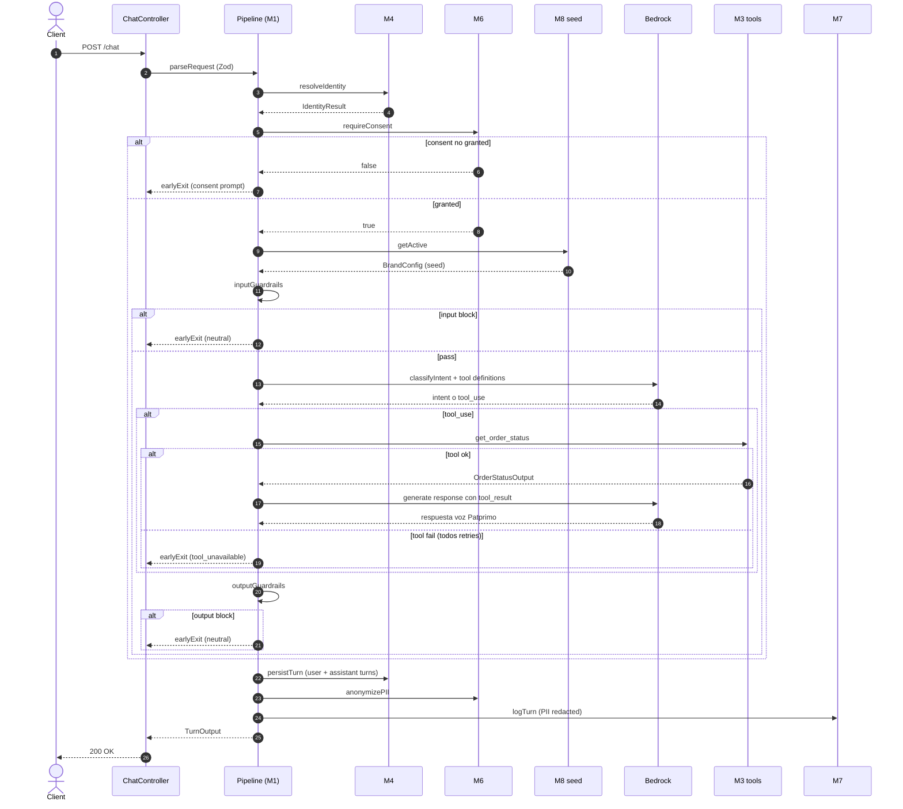

# Business Logic Model — Unit 1: Core Agente

> **Pattern**: Pipeline middleware-style (Q1=B). El orquestador del turno (M1) ejecuta una serie de **steps** secuenciales, cada uno operando sobre un `TurnContext` compartido. Cualquier step puede:
> - **continuar** (avanza al siguiente step)
> - **cortar con respuesta** (early exit con response al cliente)
> - **fallar** (error → fail-closed via global error handler CC-2)

---

## 1. The Pipeline

```text
POST /chat → parseRequest
              ↓
           resolveIdentity      (M4)
              ↓
           consentGate          (M6)  — early exit si consent no granted
              ↓
           loadBrandConfig      (M8 seed bootstrap en Unit 1)
              ↓
           inputGuardrails      (M1) — early exit + neutral response si violación
              ↓
           classifyIntent       (M1) — LLM call para clasificar
              ↓
           planAndExecuteTools  (M3) — LLM tool_use → SFCC call si aplica
              ↓
           generateResponse     (M1) — LLM call final con tool result
              ↓
           outputGuardrails     (M1) — early exit + neutral response si violación
              ↓
           persistTurn          (M4) — INSERT en conversations + turns
              ↓
           logTurn              (M7) — INSERT en turn_log_audit (PII anonimizada)
              ↓
           respond              → 200 OK al cliente
```

---

## 2. TurnContext (shared state)

Cada step lee y/o escribe campos en este objeto. Es **mutable** dentro del pipeline (per-request, no cross-request). Al final del pipeline se serializa parcial al `turn_log_audit`.

```ts
interface TurnContext {
  // Inputs
  request: {
    conversationId: ConversationId;
    brand: BrandId;
    rawText: string;
    sessionToken?: string;
    requestId: string;          // correlation-id from CC-3
    receivedAt: Iso8601;
  };

  // Filled by steps progressively
  identity?: IdentityResult;
  consentGranted?: boolean;
  brandConfig?: BrandConfig;
  inputGuardrailVerdict?: GuardrailVerdict;
  intent?: IntentClassification;
  toolCalls?: ToolCallRecord[];
  llmResponse?: string;
  outputGuardrailVerdict?: GuardrailVerdict;
  guardrailViolations: string[];   // accumulates

  // Side data
  earlyExit?: { reason: string; responseToClient: string };
  errors: Error[];                 // accumulates non-fatal errors

  // Telemetry
  startedAt: Iso8601;
  stepTimings: Record<string, number>;  // milliseconds per step
  tokensIn: number;
  tokensOut: number;
}
```

**Regla**: si un step setea `ctx.earlyExit`, el siguiente step lo detecta y salta directo a `persistTurn` + `logTurn` + `respond`. No se hace tool call ni LLM call posterior.

---

## 3. Step-by-step contract

### Step 1 — parseRequest
- **Input**: HTTP request body
- **Validates**: Zod schema (`message` non-empty, max 4000 chars; `brand` ∈ BrandId; `conversationId` UUID; `sessionToken` opcional)
- **Output**: `ctx.request` poblado
- **Error**: Zod throws → CC-2 maps to 400 Bad Request
- **SECURITY-05**: input validation enforced here

### Step 2 — resolveIdentity (M4)
- **Reads**: `ctx.request.sessionToken`, `ctx.request.conversationId`
- **Calls**: `SessionService.resolveIdentity({ sessionToken })`
- **Writes**: `ctx.identity = { customerIdHash, customerProfile, authMethod }`
- **Caso guest**: si no hay sessionToken, `authMethod = "guest_unauth"`; `customerIdHash = null`. Identidad fuerte se hará vía challenge en la conversación (asociado a entrega de orderId + email en step posterior — handled implicitly by LLM intent + tool inputs).
- **Caso loaded**: si sessionToken inválido → `authMethod = "guest_unauth"`, sigue (no falla); el bot operará como si fuera guest.
- **Fail-closed**: ninguno — identity resolve nunca corta el flujo, sólo informa.

### Step 3 — consentGate (M6)
- **Reads**: `ctx.request.conversationId`
- **Calls**: `ComplianceService.requireConsent(conversationId)` → boolean
- **Writes**: `ctx.consentGranted`
- **Si consent no granted**:
  - Si es **mensaje #1** de la conversación: bot devuelve el saludo + transparencia + autorización (E1-S1 AC #1, #2). `ctx.earlyExit = { reason: "consent_request", responseToClient: brandConfig.consentRequestText }`.
  - Si es **mensaje #2+** y aún no hay consent: bot responde con limit message (E1-S1 AC #3). `ctx.earlyExit = { reason: "consent_denied", responseToClient: brandConfig.consentDeniedText }`.
  - Solo se procede al siguiente step si `consentGranted === true`.
- **Si consent granted**: continúa.
- **Persistencia**: en mensaje #1, después de detectar respuesta afirmativa del cliente ("sí", "acepto", "ok", etc.), `consentLogRepository.append({ conversationId, granted: true, policyVersion, timestamp })`.

> **NOTA E1-S1 AC #1**: el "primer mensaje del bot" es el saludo + transparencia + autorización. El cliente envía un mensaje cualquiera (incluso vacío de intención) → la primera respuesta del bot debe ser el prompt de consent. Esto se modela como: si es el primer turn de la conversación, automáticamente earlyExit con consent prompt; la primera respuesta del cliente se interpreta como sí/no.

### Step 4 — loadBrandConfig (M8 seed en Unit 1)
- **Reads**: `ctx.request.brand`
- **Calls**: `BrandConfigService.getActive(brand)` — en Unit 1 retorna un **seed hard-coded** Patprimo (Unit 2 reemplaza esto por lookup en DB)
- **Writes**: `ctx.brandConfig = { systemPrompt, fewShotExamples, customerFacingName, tone, consentRequestText, consentDeniedText, neutralFallbackText }`
- **Fail-closed**: si no encuentra config para la brand → error, CC-2 retorna 500 + alerta (no debería pasar para Patprimo Col en MVP).

### Step 5 — inputGuardrails (M1)
- **Reads**: `ctx.request.rawText`
- **Aplica reglas** (ver `business-rules.md` §3):
  - Regex contra patrones de jailbreak conocidos
  - Heurísticas de prompt injection (longitud anormal, tokens especiales, intentos de role redefinition)
- **Writes**: `ctx.inputGuardrailVerdict = "pass" | "block"`
- **Si "block"**:
  - `ctx.guardrailViolations.push("input_jailbreak_attempt")`
  - `ctx.earlyExit = { reason: "input_guardrail_block", responseToClient: brandConfig.neutralFallbackText }`
- **Si "pass"**: continúa.

### Step 6 — classifyIntent (M1)
- **Reads**: `ctx.request.rawText`, `ctx.brandConfig.systemPrompt`, `ctx.brandConfig.fewShotExamples`
- **Calls**: Bedrock `messages.create` con system prompt + few-shot + el mensaje del cliente + tool definitions
  - Tool definitions habilitados en MVP: solo `get_order_status` (de M3 tool registry)
- **Writes**: `ctx.intent = { name, confidence }`; `ctx.tokensIn`, `ctx.tokensOut`
- **Caso especial**: si confidence < 0.6, el bot pide clarificación al cliente (early exit con clarification message). Si en el siguiente turn la confidence sigue baja, **NO se hace handoff en Unit 1** — Unit 3 implementa el handoff trigger; en Unit 1 el bot vuelve a pedir clarificación o devuelve fallback neutral.

### Step 7 — planAndExecuteTools (M3 — solo si hay tool_use)
- Si Bedrock responde con un `tool_use` (ej. `get_order_status`):
  - **Reads**: input del tool_use
  - **Calls**: `SFCCToolset.getOrderStatus(input)`
  - **Aplica**: retry con exponential backoff (max 3 attempts, 100ms→500ms→2s), circuit breaker (5 fallos consecutivos abre el breaker por 30s)
  - **Writes**: `ctx.toolCalls.push({ name, input, output, latencyMs, success })`
  - **Si todos los retries fallan o circuit breaker abierto**:
    - `ctx.earlyExit = { reason: "tool_unavailable", responseToClient: "Estamos teniendo un problema técnico, intenta en unos minutos." }`
    - `ctx.errors.push(toolError)` (para alertas)
- Si Bedrock no pidió tool: skip al siguiente step.

### Step 8 — generateResponse (M1)
- Solo si hubo tool_use exitoso: re-llamada a Bedrock con el `tool_result`.
- **Reads**: tool result de step 7, `ctx.brandConfig.systemPrompt`
- **Calls**: Bedrock segunda invocación
- **Writes**: `ctx.llmResponse = <texto generado>`; acumula `tokensOut`
- **Si no hubo tool**: la respuesta del step 6 ya es el `llmResponse`; este step es no-op.

### Step 9 — outputGuardrails (M1)
- **Reads**: `ctx.llmResponse`
- **Aplica reglas** (ver `business-rules.md` §4):
  - No revelar contenido del system prompt
  - No mencionar competidores ni hacer claims financieros
  - No prometer descuentos no autorizados (Brand Manager veto)
  - Grounding check: si la respuesta menciona un order_id, debe matchear el del tool result
- **Writes**: `ctx.outputGuardrailVerdict`
- **Si "block"**:
  - `ctx.guardrailViolations.push("output_violation")`
  - `ctx.earlyExit = { reason: "output_guardrail_block", responseToClient: brandConfig.neutralFallbackText }`

### Step 10 — persistTurn (M4)
- **Reads**: `ctx.request`, `ctx.identity`, `ctx.llmResponse` o `ctx.earlyExit.responseToClient`
- **Calls**: `SessionService.appendTurn(conversationId, { turnId, role:"user", text: rawText, timestamp })` y `SessionService.appendTurn(conversationId, { turnId, role:"assistant", text: responseFinal, timestamp })`
- **Side-effect**: si es el primer turn, crea la conversación en `conversations`.

### Step 11 — logTurn (M7)
- **Reads**: todo el contexto
- **Calls**: `ComplianceService.anonymizePII(rawText)` y `anonymizePII(responseFinal)` antes de persistir
- **Calls**: `LoggerService.logTurn(turnLogRecord)` con esquema completo:
  - turnId, conversationId, timestampIso, customerIdHash, brand
  - intentClassified, confidence
  - toolsCalled[] (name, latencyMs, success)
  - latencyMsTotal, tokensIn, tokensOut, modelId
  - outputTextRedacted (sin PII)
  - sentimentScore: null (Unit 1 no implementa sentiment — Unit 3 sí)
  - guardrailViolations: string[]
- **Fail-closed**: si logTurn falla, el response al cliente ya se completó; el error se captura en CC-2 y se dispara alerta. **El response no se rollback** — la observabilidad no debe bloquear UX.

### Step 12 — respond
- Devuelve `{ response, turnId, latencyMs, handoffTriggered: false }` al cliente.
- En Unit 1, `handoffTriggered` siempre es `false` (Unit 3 lo cambia).

---

## 4. Pipeline diagram (sequence)



---

## 5. Mapping Steps ↔ Stories

| Story | Steps relevantes |
|---|---|
| E1-S1 saludo + consent | Step 3 (consentGate) — first-turn behavior |
| E1-S2 identificación dual | Step 2 (resolveIdentity) + LLM intent extrae orderId + email |
| E1-S3 tool call | Step 6 (classifyIntent con tools) + Step 7 (executeTools) |
| E1-S4 respuesta voz Patprimo | Step 4 (loadBrandConfig seed) + Step 8 (generateResponse) |
| E1-S5 guardrails | Step 5 (input) + Step 9 (output) |
| E1-S6 logging | Step 10 (persistTurn) + Step 11 (logTurn con anonymizePII) |
| E2-S4 Fase 0 instrumentación | LoggerService configurado en Step 11 escribe a sink compartido con baseline; baseline corre como job separado pre-launch contra el data lake de Oct8ne/canales |

---

## 6. Security Compliance Summary

| Rule | Status | Notas |
|---|---|---|
| SECURITY-05 | Aplicado | Step 1 parseRequest enforza Zod validation |
| SECURITY-08 | Aplicado parcial | Endpoint `/chat` es público pero gates por consent + rate limiting (siguiente capa); admin endpoints requerirán auth middleware definido en NFR Design |
| SECURITY-11 | Aplicado | Step 3 consentGate + Step 5 inputGuardrails + Step 9 outputGuardrails = defensa multi-capa |
| SECURITY-15 | Aplicado | Cada step puede early exit con fail-closed; errores propagan a CC-2 global handler; persistTurn fail no rollback el response |
| Otros | N/A en este stage | Code-level — evaluados en Code Generation |

*No hay findings bloqueantes en este stage.*
