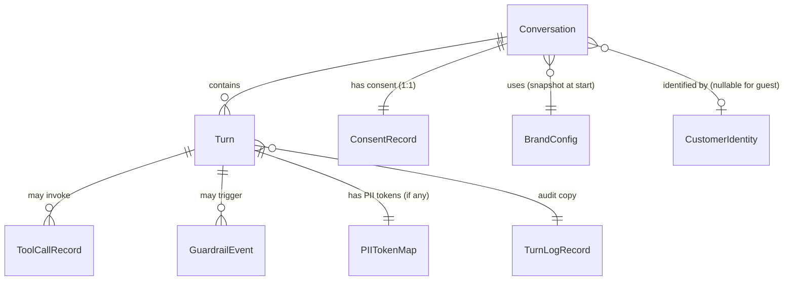

# Domain Entities — Unit 1: Core Agente

> **Scope**: entidades del dominio del Unit 1 (technology-agnostic). Cada entidad tiene atributos, relaciones, invariantes y lifecycle (cuando aplica).
> El mapping a tablas SQL concretas + indexes + constraints es responsabilidad de NFR Design / Code Generation.

---

## 1. Entity overview



---

## 2. Entity: Conversation

**Purpose**: Represents a single chat session between a customer and Hermes.

| Attribute | Type | Notes |
|---|---|---|
| `conversation_id` | UUID | PK |
| `brand` | BrandId | `"patprimo"` (en MVP Unit 1) |
| `customer_id_hash` | string \| null | null para guest pre-identificación |
| `auth_method` | enum | `sfcc_session` \| `guest_matched` \| `guest_unauth` |
| `status` | enum | `awaiting_consent` \| `active` \| `closed` \| `consent_denied` |
| `started_at` | Iso8601 | inmutable |
| `last_activity_at` | Iso8601 | actualizado en cada turn |
| `closed_at` | Iso8601 \| null | poblado al cerrar |
| `close_reason` | enum \| null | `ttl_inactivity` \| `consent_denied` \| `client_explicit_close` |
| `policy_version` | string | versión del policy de privacy aplicada |

**Invariantes:**
- `status === "closed"` ⟹ `closed_at !== null` y `close_reason !== null`
- `status === "consent_denied"` ⟹ existe ConsentRecord con `granted=false`
- `started_at <= last_activity_at <= closed_at` (cuando aplica)

**State lifecycle:**

```text
                 [new request, no conv exists]
                              ↓
                    ╔════════════════════╗
                    ║  awaiting_consent   ║ ←┐
                    ╚═════════╤══════════╝  │ (re-prompt una vez)
                              │              │
                ┌─────────────┴───────────┐ │
                ↓                         ↓ │
       (granted=true)              (granted=false)
                ↓                         │ │
        ╔═════════════╗                   ↓ │
        ║   active    ║          ╔══════════════════╗
        ╚══════╤══════╝          ║  consent_denied  ║
               │                  ╚══════════════════╝
               │
       (30 min sin actividad O cliente cierra)
               ↓
        ╔═════════════╗
        ║   closed    ║
        ╚═════════════╝
```

---

## 3. Entity: Turn

**Purpose**: A single back-and-forth exchange within a Conversation. Cada interacción (user message + assistant response) crea **dos** Turn records: uno `role=user`, otro `role=assistant`.

| Attribute | Type | Notes |
|---|---|---|
| `turn_id` | UUID | PK |
| `conversation_id` | UUID | FK |
| `role` | enum | `user` \| `assistant` \| `system` (system para errores notables) |
| `text` | string | contenido. **PII raw en este campo** (visible a operador en drill-down; PII anonimizada en turn_log_audit) |
| `intent` | string \| null | clasificación de intención (solo para `role=user` que pasó por classify) |
| `confidence` | number \| null | 0–1 |
| `timestamp` | Iso8601 | |
| `latency_ms` | number \| null | tiempo end-to-end para este turn (solo `role=assistant`) |
| `tokens_in` | number \| null | |
| `tokens_out` | number \| null | |
| `model_id` | string \| null | ej. `anthropic.claude-haiku-4-5:0` |
| `early_exit_reason` | enum \| null | `consent_request` \| `consent_denied` \| `input_guardrail_block` \| `output_guardrail_block` \| `tool_unavailable` \| `rate_limit` \| null |

**Invariantes:**
- `role === "user"` ⟹ `latency_ms === null`, `tokens_*` y `model_id === null`
- `early_exit_reason !== null` ⟹ `role === "assistant"`
- `text` máximo 4000 chars (truncar si excede)

---

## 4. Entity: ConsentRecord

**Purpose**: Append-only log de cada decisión de consent.

| Attribute | Type | Notes |
|---|---|---|
| `consent_id` | UUID | PK |
| `conversation_id` | UUID | FK |
| `granted` | boolean | |
| `timestamp` | Iso8601 | |
| `policy_version` | string | |
| `client_text` | string | el texto exacto del cliente que se interpretó (auditabilidad SIC) |

**Invariantes:**
- **Append-only**: nunca UPDATE ni DELETE. Si el cliente cambia de opinión, se inserta nuevo record con `granted=true`.
- El `granted` efectivo para una conversation = el último record por `timestamp DESC`.

---

## 5. Entity: BrandConfig (seed snapshot en Unit 1)

**Purpose**: Configuración de personalidad de la marca consumida por el orquestador.

| Attribute | Type | Notes |
|---|---|---|
| `brand` | BrandId | PK |
| `version_id` | string | en Unit 1 = `"seed-1"`; Unit 2 introducirá versionado real |
| `system_prompt` | string | hardened, define la voz Patprimo |
| `few_shot_examples` | FewShotExample[] | 10–20 ejemplos validados |
| `customer_facing_name` | string | ej. `"Sofía de Patprimo"` |
| `tone` | enum | `formal_close` (Patprimo MVP) |
| `language` | enum | `es-CO` |
| `consent_request_text` | string | mensaje inicial de saludo + transparencia + autorización |
| `consent_denied_text` | string | respuesta cuando cliente niega consent |
| `neutral_fallback_text` | string | respuesta cuando guardrail block o tool unavailable |
| `policy_version` | string | versión del policy de privacy referenciada |

**En Unit 1**: estos valores son **hard-coded** en `hermes/src/config/brand-seed.ts`. El service `BrandConfigService.getActive(brand)` retorna este seed.

**Unit 2** reemplaza el seed con la versión persistida en DB con versioning + sign-off.

---

## 6. Entity: CustomerIdentity (derivada, no persistida directamente)

**Purpose**: Representa la identidad resuelta dentro del turno. **No** es una tabla separada — se reconstruye en cada request desde SFCC + datos en la conversation.

| Attribute | Type | Notes |
|---|---|---|
| `customer_id_hash` | string \| null | `sha256(sfcc_customer_id + salt)` |
| `customer_profile` | CustomerProfile \| null | desde SFCC, solo en memoria del request (no persistir PII raw) |
| `auth_method` | enum | `sfcc_session` \| `guest_matched` \| `guest_unauth` |
| `verified_against_order` | string \| null | orderId usado para verificar guest match |

**Lifecycle**: vive solo durante el turn — al final del request se descarta de memoria. La parte hasheada se persiste en `Conversation.customer_id_hash` cuando se establece.

---

## 7. Entity: ToolCallRecord

**Purpose**: Detalle de cada invocación de tool (M3) dentro de un turn.

| Attribute | Type | Notes |
|---|---|---|
| `tool_call_id` | UUID | PK |
| `turn_id` | UUID | FK |
| `tool_name` | string | ej. `"get_order_status"` |
| `input_hash` | string | sha256 de los args (NO persistir args con PII raw) |
| `success` | boolean | |
| `latency_ms` | number | |
| `error_class` | string \| null | ej. `"timeout"` \| `"circuit_breaker_open"` \| `"sfcc_4xx"` |
| `retries_used` | number | 0–3 |

---

## 8. Entity: GuardrailEvent

**Purpose**: Registro de cualquier disparo de guardrail (input o output).

| Attribute | Type | Notes |
|---|---|---|
| `event_id` | UUID | PK |
| `turn_id` | UUID | FK |
| `layer` | enum | `input` \| `output` |
| `category` | string | ej. `"input_jailbreak_attempt"` \| `"output_grounding_failure"` |
| `pattern_matched` | string | el regex/pattern específico (NO el contenido del cliente) |
| `severity` | enum | `low` \| `medium` \| `high` |
| `timestamp` | Iso8601 | |

---

## 9. Entity: PIITokenMap

**Purpose**: Mapping reversible entre tokens (`<EMAIL_1>`, etc.) y hash del valor original, ligado a un turn. **NO contiene PII raw**.

| Attribute | Type | Notes |
|---|---|---|
| `map_id` | UUID | PK |
| `turn_id` | UUID | FK |
| `token` | string | ej. `<EMAIL_1>` |
| `value_hash` | string | sha256 del valor PII original con salt |
| `value_type` | enum | `email` \| `phone` \| `order_id` \| `card` \| `cedula` |

**Uso**: en Unit 3, cuando el agente humano necesita ver la PII real en el paquete de handoff, se hace cross-lookup turn → SFCC (no se almacena PII raw acá, se re-resuelve desde SFCC en el momento del handoff). En Unit 1, el map es write-only.

---

## 10. Entity: TurnLogRecord (audit copy)

**Purpose**: Copia auditable del turn con PII anonimizada. Append-only. Retención mínima 90 días (SECURITY-14).

| Attribute | Type | Notes |
|---|---|---|
| `log_id` | UUID | PK |
| `turn_id` | UUID | FK (refleja el turn) |
| `conversation_id` | UUID | denormalizado para queries rápidas |
| `timestamp_iso` | Iso8601 | |
| `customer_id_hash` | string \| null | |
| `brand` | BrandId | |
| `intent_classified` | string \| null | |
| `tools_called` | string[] | nombres únicos invocados en este turn |
| `latency_ms` | number \| null | |
| `tokens_in` | number \| null | |
| `tokens_out` | number \| null | |
| `model_id` | string \| null | |
| `output_text_redacted` | string | PII anonimizada con `<EMAIL_1>`, etc. |
| `sentiment_score` | number \| null | null en Unit 1; Unit 3 puede agregar |
| `guardrail_violations` | string[] | |
| `early_exit_reason` | string \| null | |

**Append-only enforcement**: el usuario de DB que la aplicación usa **no tiene permiso DELETE/UPDATE** sobre esta tabla. Solo INSERT. Operaciones de retención/forget se hacen vía un rol distinto (separation of duties).

---

## 11. Relationships summary

| Relación | Cardinalidad | Notas |
|---|---|---|
| Conversation → Turn | 1:N | Turn no existe sin Conversation |
| Conversation → ConsentRecord | 1:N (append) | Pero efectivo = último |
| Conversation → BrandConfig | N:1 | Snapshot at start; cambios futuros en BrandConfig NO afectan conversaciones activas |
| Turn → ToolCallRecord | 1:N | 0 si turn no usó tools |
| Turn → GuardrailEvent | 1:N | 0 si no hubo violaciones |
| Turn → PIITokenMap | 1:N | 0 si no hubo PII detectada |
| Turn → TurnLogRecord | 1:1 | Una copia audit por turn (write-once) |

---

## 12. Security Compliance Summary

| Rule | Status | Notas |
|---|---|---|
| SECURITY-13 (data integrity) | Aplicado | ConsentRecord y TurnLogRecord append-only por design; permisos DB enforzados a nivel de role |
| SECURITY-14 (logging retention) | Aplicado | Retención ≥90 días declarada para TurnLogRecord |
| SECURITY-03 (no PII in logs) | Aplicado | TurnLogRecord.output_text_redacted es el único campo de texto; siempre anonimizado |
| SECURITY-11 | Aplicado | Separación de duties: app role solo INSERT en logs; retención corre con role distinto |
| Otros | N/A | Code/infra-level — evaluados en Code Generation + Infrastructure Design |

*No hay findings bloqueantes en este stage.*
