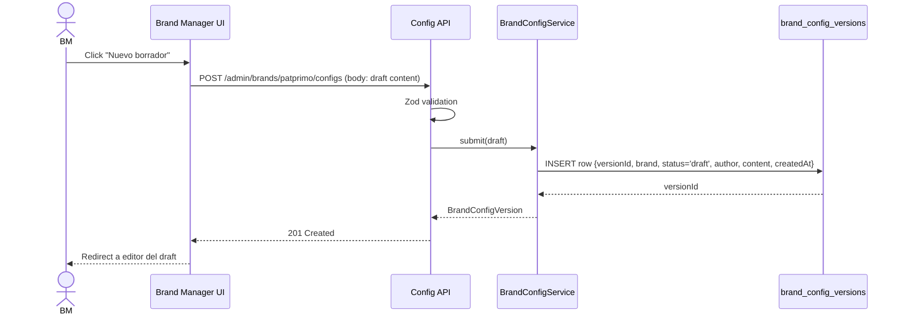
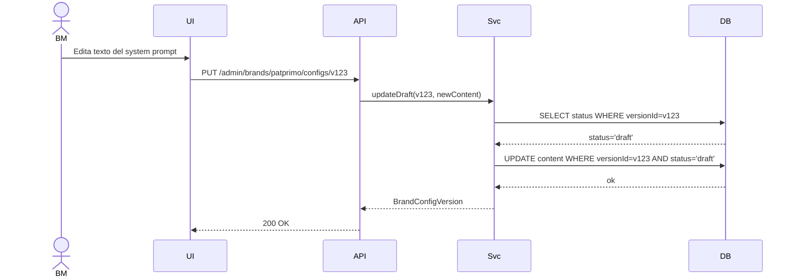
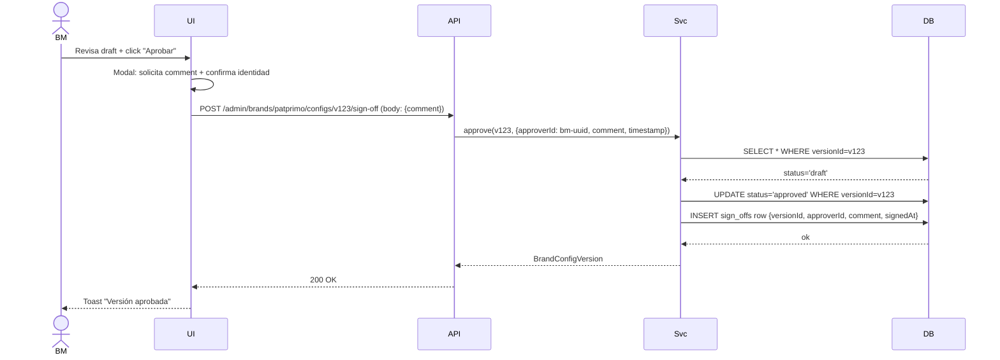
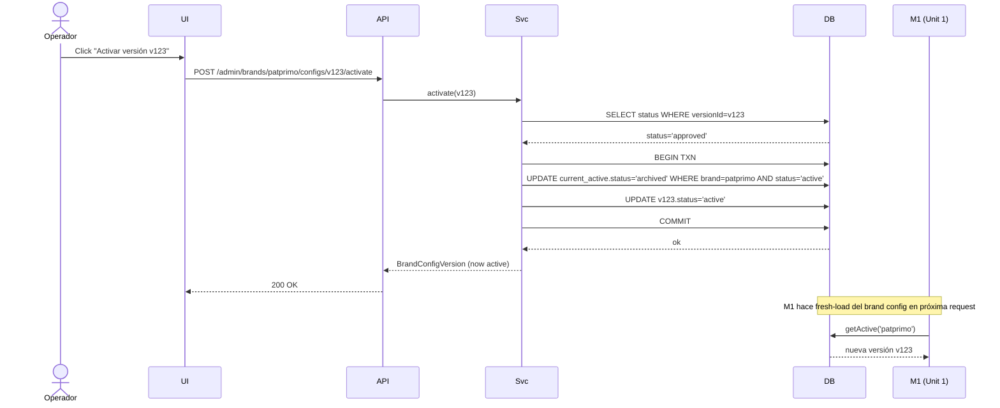
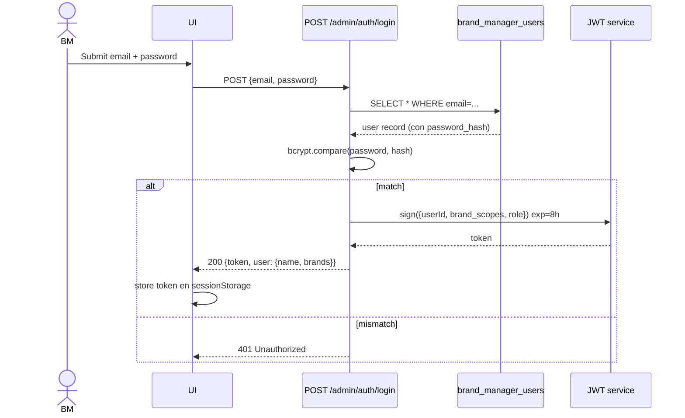

# Business Logic Model — Unit 2: Knowledge & Brand Voice

> **Scope**: workflow de gobernanza del brand config (drafts → sign-off → activate → rollback) + UI dedicada Brand Manager + M2 Knowledge stub.
> **Stories implementadas**: E4-S1 (gruesa, todos los AC Gherkin)

---

## 1. Big picture

```mermaid
flowchart TB
    BM[Brand Manager<br/>Persona P4]
    OP[Operador<br/>Persona P3]
    M1[M1 ConversationService<br/>Unit 1 consumer]

    subgraph Frontend["Brand Manager UI (dashboard)"]
        Login[Login form]
        Dashboard[Versions dashboard]
        Editor[Draft editor]
        Review[Review interface]
    end

    subgraph Backend["Backend M8"]
        AuthAPI[Auth API<br/>POST /admin/auth/login]
        ConfigAPI[Brand Config API<br/>CRUD + sign-off + activate]
        BrandConfigService[BrandConfigService]
        BrandConfigRepo[(brand_config_versions<br/>+ sign_offs)]
        KnowledgeService[M2 KnowledgeService stub<br/>returns []]
    end

    BM -->|browser| Login
    Login -->|JWT| AuthAPI
    BM --> Dashboard
    Dashboard --> ConfigAPI
    BM --> Editor
    Editor -->|POST/PUT| ConfigAPI
    BM --> Review
    Review -->|sign-off action| ConfigAPI
    OP -->|fallback admin| ConfigAPI

    ConfigAPI --> BrandConfigService
    BrandConfigService --> BrandConfigRepo
    M1 -->|getActive(brand)| BrandConfigService
    M1 -->|Fase 2 RAG queries| KnowledgeService

    style BrandConfigService fill:#4CAF50,color:#fff
    style BrandConfigRepo fill:#9cf,color:#000
    style KnowledgeService fill:#BDBDBD,color:#000
```

---

## 2. The state machine: BrandConfigVersion

Una versión del brand config atraviesa estos estados:

```text
                  ╔══════════╗
       Create →   ║  draft   ║
                  ╚════╤═════╝
                       │ BM revisa + aprueba
                       ▼
                  ╔══════════╗
                  ║ approved ║   (firmado, listo para activar)
                  ╚════╤═════╝
                       │ activate(versionId)
                       ▼
                  ╔══════════╗
                  ║  active  ║   (M1 la consume en runtime)
                  ╚════╤═════╝
                       │ otra versión se activa O archive(versionId)
                       ▼
                  ╔══════════╗
                  ║ archived ║   (versión vieja, conserva audit trail)
                  ╚══════════╝
```

**Transiciones permitidas:**

| From | To | Trigger | Quién puede |
|---|---|---|---|
| (none) | `draft` | `createDraft(brand, content)` | BM o Operador |
| `draft` | `draft` | `updateDraft(versionId, content)` (in-place edit) | BM o Operador autor original |
| `draft` | `approved` | `approve(versionId, signOffData)` | BM con permiso sobre `brand` |
| `draft` | (deleted) | `discardDraft(versionId)` | BM o Operador autor |
| `approved` | `active` | `activate(versionId)` | BM o Operador |
| `active` | `archived` | otra versión se activa (automático) | (sistema) |
| `approved` | `archived` | `archive(versionId)` manual o si nueva approved se prefiere | BM u Operador |

**Transiciones prohibidas:**
- `archived` → ningún estado (irrevocable; si quieres reusar, copia a draft)
- `draft` → `active` (no se puede saltar approval gate)
- `approved` → `draft` (no se puede des-aprobar; si hay error, crear draft nuevo)

---

## 3. Workflow flows (paso a paso)

### 3.1 Flow A — Crear nueva versión desde cero



### 3.2 Flow B — Editar draft existente



> **Regla**: si el `status` NO es `draft`, el UPDATE falla con `ConflictError` (R-BC-2).

### 3.3 Flow C — Sign-off Brand Manager



### 3.4 Flow D — Activación



> **Regla R-BC-5**: la activación es atómica (transacción). NO puede haber dos versiones `active` simultáneas por la misma `brand`.

### 3.5 Flow E — Rollback (pick-from-list)

```mermaid
sequenceDiagram
    actor OP
    participant UI
    participant API
    participant Svc
    participant DB

    OP->>UI: Ve historial; selecciona v100 (aprobada anterior)
    OP->>UI: Click "Activar v100"
    UI->>API: POST /admin/brands/patprimo/configs/v100/activate
    Note over API,DB: Mismo flow de activación (Flow D)
    API->>Svc: activate(v100)
    Note over Svc: Pre-condición: v100.status ∈ {approved, archived}
    Svc->>DB: SELECT v100.status
    alt v100.status='archived' o 'approved'
        Svc->>DB: BEGIN TXN
        Svc->>DB: UPDATE current_active.status='archived'
        Svc->>DB: UPDATE v100.status='active'
        Svc->>DB: COMMIT
    else v100.status='draft'
        Svc-->>API: 409 Conflict "version not approved"
    end
```

> **Importante**: rollback ≠ unapprove. Una versión archivada conserva su sign-off original; al re-activarse no requiere re-aprobación (el sign-off es del contenido, no del momento de activación).

### 3.6 Flow F — M1 consume el brand config (integration point IP-1 con Unit 1)

En Unit 1, el step `loadBrandConfig` del pipeline llama `BrandConfigService.getActive(brand)`. **En Unit 1 retorna seed hardcoded.** En Unit 2 se reemplaza:

```ts
async function getActive(brand: BrandId): Promise<BrandConfig> {
  const row = await this.repo.findActive(brand);
  if (!row) {
    // fail-closed — no fallback al seed (porque podría estar desincronizado)
    throw new InternalError('no active brand config for ' + brand);
  }
  return this.mapToConfig(row);
}
```

**IP-1 transición**: Unit 1 usa `BrandConfigService` con implementación seed. Unit 2 lo sustituye con implementación DB. La interfaz NO cambia → M1 no requiere modificación.

**Feature flag de transición** (opcional, recomendado):
- env var `BRAND_CONFIG_SOURCE` = `seed` | `db`
- Default `seed` durante Unit 2 development; flip a `db` al deploy de Unit 2.

---

## 4. Authentication flow para Brand Manager UI



**Authorization**: cada admin endpoint requiere middleware que valida JWT + verifica `req.user.brand_scopes` incluye la `brand` del path. BM solo puede tocar sus marcas asignadas.

> **MVP scope**: roles simples — `brand_manager` (con scopes) y `operator` (cross-brand). Sin RBAC granular.

---

## 5. M2 Knowledge stub behavior

Implementación mínima (Q6=A):

```ts
class KnowledgeService implements IKnowledgeService {
  async search(query: string, brand: BrandId, k = 5): Promise<KnowledgeHit[]> {
    return []; // pure stub
  }
}
```

**Sin tabla pgvector en Unit 2.** Cuando Fase 2 implemente RAG real:
- Crear tabla `knowledge_embeddings` (pgvector)
- Implementar ingest pipeline desde SFCC catalog
- Reemplazar el body del `search()`
- La interfaz `IKnowledgeService` no cambia → cero impacto en M1.

---

## 6. Mapping flows ↔ E4-S1 AC Gherkin

| AC Gherkin (E4-S1) | Flow / Rule cubre |
|---|---|
| Scenario "System prompt v1 validado por BM" | Flow A (create) + Flow C (sign-off) |
| Scenario "Muestra semanal post-launch" | **Out of scope** (Q5=C); marcado en plan |
| Scenario "Veto mid-launch dispara rollback" | Flow E (rollback) + R-BC-7 (alerta a Operador) |
| Scenario "Versionado de configuraciones por marca" | Flows A, B + R-BC-1..R-BC-4 |

---

## 7. Out of Unit 2 (referencias hacia adelante)

- ❌ **Muestra weekly conversaciones** — Out of scope MVP (Q5=C); dashboard del Operador (E2-S1) es Unit 3.
- ❌ **M2 Knowledge funcional (RAG)** — Stub en MVP; Fase 2 lo implementa.
- ❌ **Brand Manager UI per-other-marca (Seven Seven, Ostu, Atmos)** — MVP solo Patprimo; los otros 3 BMs no tienen acceso hasta Fase 2.

---

## 8. Security Compliance Summary

| Rule | Status | Implementación |
|---|---|---|
| SECURITY-05 | Aplicado | Zod validation en cada admin endpoint |
| SECURITY-06 | Aplicado | Brand Manager scoped solo a su marca; rol `brand_manager` distinto de `operator` |
| SECURITY-08 | Aplicado | Cada admin endpoint requiere JWT válido + scope check; CORS restrictivo |
| SECURITY-11 | Aplicado | Workflow gobernanza (draft→approved→active) previene cambio accidental sin review |
| SECURITY-12 | Aplicado | Auth con bcrypt password hashing; JWT exp 8h; sin hardcoded credentials |
| SECURITY-13 | Aplicado | sign_offs table append-only (sign-off histórico inmutable); transiciones de estado son log-able |
| Otros | N/A en este stage | Code-level — evaluados en stages siguientes |

*No hay findings bloqueantes en este stage.*
