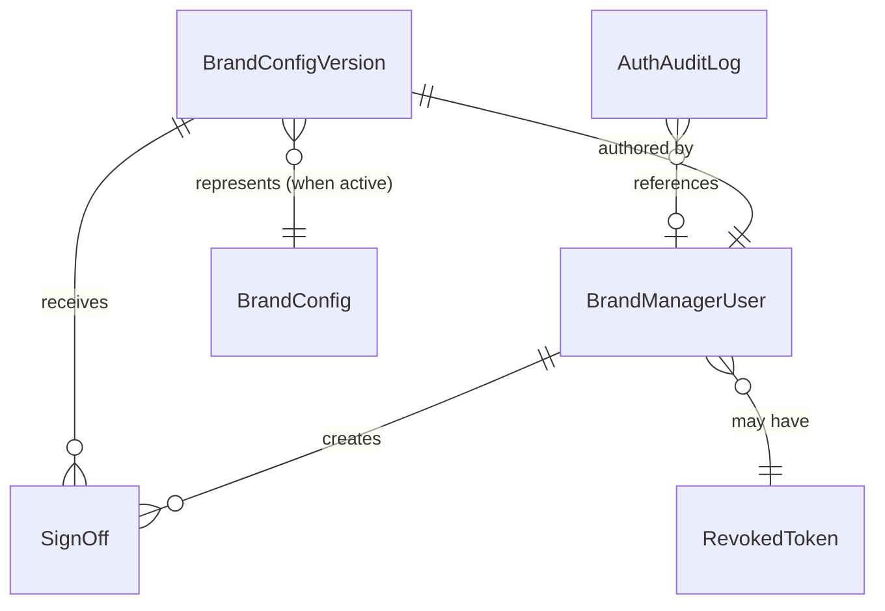

# Domain Entities — Unit 2: Knowledge & Brand Voice

> **Scope**: entidades nuevas en Unit 2 + extensiones a entidades de Unit 1.

---

## 1. Entity overview



> Las entidades `BrandConfig` y `Brand` ya existen conceptualmente desde Unit 1 — Unit 2 las extiende con versioning.

---

## 2. Entity: BrandConfigVersion

**Purpose**: una versión específica del brand config (incluye drafts, approved, active, archived).

| Attribute | Type | Notes |
|---|---|---|
| `version_id` | UUID | PK; inmutable (R-BC-4) |
| `brand` | BrandId | `"patprimo"` en MVP |
| `status` | enum | `draft` \| `approved` \| `active` \| `archived` |
| `system_prompt` | text | 100-10000 chars (R-ERR-BC-2) |
| `few_shot_examples` | JSONB | array de FewShotExample (5-30 items) |
| `customer_facing_name` | string | ej. `"Sofía de Patprimo"` |
| `tone` | enum | `formal_close` \| `casual` \| `formal` |
| `language` | string | `es-CO` |
| `consent_request_text` | text | mensaje de saludo inicial (Unit 1 consumer) |
| `consent_denied_text` | text | respuesta on consent denied |
| `neutral_fallback_text` | text | respuesta on guardrail block |
| `policy_version` | string | versión del privacy policy referenciado |
| `author_id` | UUID | FK → `brand_manager_users.user_id` (puede ser NULL si user borrado) |
| `created_at` | Iso8601 | inmutable |
| `updated_at` | Iso8601 | actualizado on UPDATE de draft |
| `activated_at` | Iso8601 \| null | poblado al pasar a `active` |
| `archived_at` | Iso8601 \| null | poblado al pasar a `archived` |

**Invariantes:**
- `status = "active"` ⟹ `activated_at IS NOT NULL`
- `status = "archived"` ⟹ `archived_at IS NOT NULL`
- Constraint único parcial: `UNIQUE (brand) WHERE status = 'active'` — máximo 1 versión active por marca.
- `version_id` se asigna en INSERT y nunca cambia.

**State machine** (R-BC-1..R-BC-6 en business-rules.md):

```text
        ╔══════════════════════════════════════════╗
        ║                                          ║
   (new) ──▶ draft ──approve──▶ approved ──activate──▶ active
                ▼                  │                    │
            discard               │                   │
                ▼                  ▼                   ▼
            (deleted)          archived  ◀── otra activate
                                  │
                                  ▼
                              (terminal)
```

---

## 3. Entity: SignOff

**Purpose**: registro append-only de cada decisión de aprobación o rechazo de un draft.

| Attribute | Type | Notes |
|---|---|---|
| `signoff_id` | UUID | PK |
| `version_id` | UUID | FK → BrandConfigVersion |
| `approver_id` | UUID | FK → BrandManagerUser (NOT NULL en creación; nullable on user delete) |
| `decision` | enum | `approved` \| `rejected` |
| `comment` | text | puede ser vacío string pero NO NULL |
| `signed_at` | Iso8601 | server-generated |
| `approved_on_behalf_of` | UUID \| null | si Operador firmó en representación, apunta al BM original; null si BM firmó directamente |

**Invariantes:**
- **Append-only** (R-SO-2): nunca UPDATE/DELETE.
- Si `decision='approved'`, debe existir al menos un `INSERT` antes de que la versión pase a `status='approved'` (R-SO-5).

---

## 4. Entity: BrandManagerUser

**Purpose**: usuario humano que opera el BM UI; modelo simple para MVP.

| Attribute | Type | Notes |
|---|---|---|
| `user_id` | UUID | PK |
| `email` | string (unique) | identificador de login |
| `password_hash` | string | bcrypt con saltRounds=12 (R-AUTH-1) |
| `display_name` | string | nombre completo o alias |
| `role` | enum | `brand_manager` \| `operator` \| `admin` |
| `brand_scopes` | text[] | array de BrandId; para `brand_manager` define qué marcas puede tocar. Para `operator` y `admin` se ignora (cross-brand). |
| `created_at` | Iso8601 | |
| `last_login_at` | Iso8601 \| null | actualizado en cada login exitoso |
| `failed_attempts` | int | counter para brute-force protection (R-AUTH-5); reset on login exitoso |
| `locked_until` | Iso8601 \| null | si lock activo (R-AUTH-5) |
| `is_active` | boolean | soft-delete; queries de auth filtran `WHERE is_active=true` |

**Notas operativas:**
- Creación de usuarios solo via script administrativo del equipo Hermes (R-AUTH-8 — sin self-service).
- Password se setea por admin que ejecuta el script; usuario debe cambiarla en primer login (Fase 2; MVP usa la inicial).

---

## 5. Entity: RevokedToken

**Purpose**: blacklist de JWTs revocados pre-expiración (logout, password change, etc.).

| Attribute | Type | Notes |
|---|---|---|
| `token_jti` | string | PK; JWT `jti` claim (UUID) |
| `revoked_at` | Iso8601 | |
| `revoked_by` | UUID | FK → BrandManagerUser |
| `reason` | enum | `logout` \| `password_change` \| `admin_force` |
| `expires_at` | Iso8601 | igual al `exp` del JWT original — cleanup job purga rows con `expires_at < NOW()` |

**Cleanup**: job daily purga rows expirados (tabla no debe crecer indefinidamente).

---

## 6. Entity: AuthAuditLog

**Purpose**: log append-only de eventos de autenticación (R-AUTH-7).

| Attribute | Type | Notes |
|---|---|---|
| `log_id` | UUID | PK |
| `email` | string | email del attempt (NO se hashea aquí porque es la identidad del usuario, no PII del cliente final) |
| `ip` | string | IP del request (anonimizado a /24 si compliance lo exige; MVP guarda raw) |
| `user_agent` | string | truncado a 500 chars |
| `result` | enum | `success` \| `invalid_password` \| `user_not_found` \| `locked` \| `expired_token` |
| `user_id` | UUID \| null | poblado si `result='success'` |
| `timestamp` | Iso8601 | |

**Retention**: 90 días minimum (SECURITY-14).

---

## 7. Entity changes en Unit 1 (extensiones)

### 7.1 `brand_configs` table (de Unit 1)

En Unit 1 esta tabla tenía 1 fila per brand (seed). En Unit 2 **se renombra** y **se extiende**:

**Antes (Unit 1)**: `brand_configs` con 1 fila `patprimo`.

**Después (Unit 2)**: `brand_config_versions` (tabla principal de §2) — soporta múltiples filas per brand con state.

**Migration path**:
- Migration de Unit 2 incluye `ALTER TABLE brand_configs RENAME TO brand_config_versions` + ADD columns nuevas (version_id como nuevo PK, status, author_id, etc.)
- O alternativamente: DROP `brand_configs` y CREATE `brand_config_versions` desde cero, con migration que copia el seed Patprimo a la nueva tabla con `status='active'`.

**Recomendación**: crear nueva tabla limpia (la rename con muchas columnas nuevas es más frágil). Definición final en Code Generation Unit 2.

### 7.2 `IBrandConfigService` (interface de Unit 1)

La interface NO cambia. Solo cambia la implementación:
- Unit 1: `getActive()` retorna seed hardcoded.
- Unit 2: `getActive()` consulta `brand_config_versions WHERE brand=$1 AND status='active' LIMIT 1`.

Métodos NUEVOS que se agregan en Unit 2:
- `submit(draft)`
- `updateDraft(versionId, content)`
- `discardDraft(versionId)`
- `approve(versionId, signOff)`
- `reject(versionId, signOff)`
- `activate(versionId)`
- `archive(versionId)`
- `list(brand, filter?)` — para BM UI listing
- `getById(versionId)`
- `getSignOffs(versionId)`

---

## 8. Sample data — Patprimo seed en `brand_config_versions`

Cuando Unit 2 deploya, la migration siembra la versión Patprimo equivalente al hardcoded de Unit 1:

```sql
INSERT INTO brand_config_versions (
  version_id, brand, status,
  system_prompt, few_shot_examples,
  customer_facing_name, tone, language,
  consent_request_text, consent_denied_text, neutral_fallback_text,
  policy_version,
  author_id,
  created_at, activated_at
) VALUES (
  'patprimo-seed-v1', 'patprimo', 'active',
  '<system prompt aprobado>',
  '[<few shot examples>]'::jsonb,
  'Sofía de Patprimo', 'formal_close', 'es-CO',
  '<consent prompt>', '<consent denied>', '<neutral fallback>',
  'patprimo-policy-v1',
  NULL,  -- author es el equipo Hermes inicial, no BM
  NOW(), NOW()
);
INSERT INTO sign_offs (
  signoff_id, version_id, approver_id, decision, comment, signed_at, approved_on_behalf_of
) VALUES (
  gen_random_uuid(), 'patprimo-seed-v1', NULL, 'approved',
  'Seed inicial sembrado por equipo Hermes; pendiente sign-off formal de Brand Manager Patprimo en primer review.',
  NOW(), NULL
);
```

> Esto deja `patprimo-seed-v1` como `active` desde el momento del deploy → M1 no rompe. El primer flow real de BM será aprobar una v2 que reemplace este seed.

---

## 9. Index strategy

| Table | Indexes |
|---|---|
| `brand_config_versions` | PK on `version_id`; unique partial `WHERE status='active'` (brand); index on `(brand, status, created_at DESC)` para listings |
| `sign_offs` | PK on `signoff_id`; index on `(version_id, signed_at DESC)` |
| `brand_manager_users` | PK on `user_id`; unique on `email` (lowercase); index on `is_active` |
| `revoked_tokens` | PK on `token_jti`; index on `expires_at` (para cleanup) |
| `auth_audit_log` | PK on `log_id`; index on `(email, timestamp DESC)`; index on `timestamp` (retention purge) |

---

## 10. M2 Knowledge — sin entidades nuevas

Decisión Q6=A: **stub puro sin tabla**. Cuando Fase 2 implemente RAG, se agregarán:
- `knowledge_documents` — fuente raw (catalog items, policies)
- `knowledge_embeddings` — pgvector embeddings con FK al documento
- `knowledge_queries_log` — telemetría (Fase 2 decision)

En Unit 2 ninguna de estas existe.

---

## 11. Security Compliance Summary

| Rule | Aplicación |
|---|---|
| SECURITY-06 | `brand_manager_users.role` distingue `brand_manager`/`operator`/`admin`; `brand_scopes` enforza least-priv |
| SECURITY-12 | `password_hash` bcrypt; `failed_attempts` + `locked_until` brute-force; `revoked_tokens` para logout server-side |
| SECURITY-13 | `sign_offs` append-only (R-SO-2); `auth_audit_log` append-only |
| SECURITY-14 | `auth_audit_log` retention ≥90d; cleanup job purga `revoked_tokens` expirados |
| Otros | Cubiertos en business-rules.md §9 |

*No hay findings bloqueantes en este stage.*
