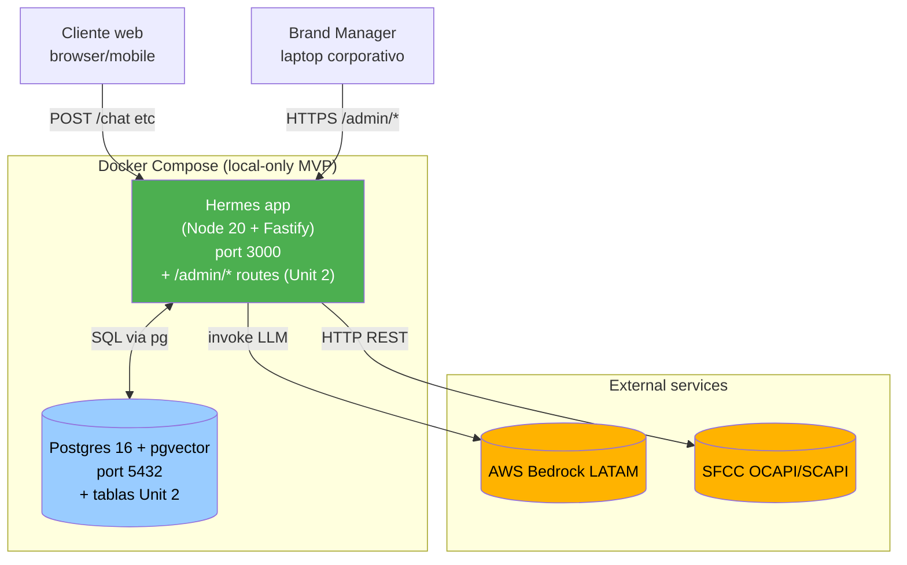

# Logical Components — Unit 2: Knowledge & Brand Voice

> **Scope**: delta vs Unit 1 — no servicios nuevos, solo nuevas tablas + componentes lógicos internos al mismo container.

---

## 1. Topology — sin cambio

**Sin cambios infra vs Unit 1**: 2 containers (Hermes app + Postgres). Sin Redis, sin queue, sin proceso separado para admin (Q2=A).

---

## 2. Components dentro de la Hermes app (delta Unit 2)

### 2.1 Nuevos services
| Service | Lives in | Implements |
|---|---|---|
| `AuthService` | `services/auth/auth.service.ts` | login + logout + verify |
| `JwtService` | `services/auth/jwt.service.ts` | sign + verify JWTs |
| `AuthAuditService` | `services/auth/audit.service.ts` | write entries en `auth_audit_log` |
| `DiffService` | `services/diff.service.ts` | server-side diff render |
| `BrandConfigService` (extendido) | `services/brand-config.service.ts` | CRUD + sign-off + activate + rollback (reemplaza el stub seed de Unit 1) |

### 2.2 Nuevos plugins Fastify
| Plugin | Lives in | Propósito |
|---|---|---|
| `auth.plugin.ts` | `plugins/auth.plugin.ts` | Registra `@fastify/jwt` + decorator `fastify.authenticate` |
| `brand-scope.plugin.ts` | `plugins/brand-scope.plugin.ts` | Decorator `fastify.requireBrandScope` |
| `view.plugin.ts` | `plugins/view.plugin.ts` | Registra `@fastify/view` con EJS engine |
| `static-admin.plugin.ts` | `plugins/static-admin.plugin.ts` | Registra `@fastify/static` para `/admin/assets/*` |
| `m8-brand-config-full.plugin.ts` | `plugins/m8-brand-config-full.plugin.ts` | Reemplaza el plugin stub de Unit 1; ahora con CRUD completo |

### 2.3 Nuevos repositories
| Repo | Lives in |
|---|---|
| `BrandManagerUserRepo` | `repositories/brand-manager-user.repo.ts` |
| `SignOffRepo` | `repositories/sign-off.repo.ts` |
| `RevokedTokenRepo` | `repositories/revoked-token.repo.ts` |
| `AuthAuditRepo` | `repositories/auth-audit.repo.ts` |
| `BrandConfigVersionRepo` | `repositories/brand-config-version.repo.ts` (reemplaza `brand-config.repo.ts` de Unit 1) |

### 2.4 Nuevos controllers (routes admin)
| Controller | Routes |
|---|---|
| `auth.controller.ts` | `POST /admin/auth/login`, `POST /admin/auth/logout` |
| `brand-config-admin.controller.ts` | CRUD + sign-off + activate sobre `/admin/brands/:brand/configs/*` |
| `brand-config-view.controller.ts` | renderea las páginas EJS (`/admin/brands/:brand/configs` GET, etc.) |
| `admin-static.controller.ts` (auto via plugin) | sirve assets `/admin/assets/*` |

### 2.5 Nuevos jobs
| Job | Schedule | Lives in |
|---|---|---|
| `revoked-tokens-cleanup.job` | daily 00:00 UTC | `jobs/revoked-tokens-cleanup.job.ts` |
| `auth-audit-retention.job` | weekly lunes 00:00 UTC | `jobs/auth-audit-retention.job.ts` |
| `bm-user-unlock.job` | cada 15 min | `jobs/bm-user-unlock.job.ts` |

Registrados en el mismo `job-runner.ts` de Unit 1.

### 2.6 Nuevas vistas EJS
| Template | Renderea |
|---|---|
| `views/layouts/main.ejs` | layout base con header + nav + footer |
| `views/admin/login.ejs` | página login |
| `views/admin/dashboard.ejs` | listado de versiones |
| `views/admin/version-editor.ejs` | form create/edit draft |
| `views/admin/version-detail.ejs` | detail + actions |
| `views/_partials/status-badge.ejs` | chip color por status |
| `views/_partials/diff-viewer.ejs` | render del diff |
| `views/_partials/toast.ejs` | notification toast |
| `views/_partials/confirm-modal.ejs` | modal de confirmación |

### 2.7 Nuevos assets estáticos
| File | Path |
|---|---|
| `admin.css` | `public/admin/css/admin.css` |
| `admin.js` | `public/admin/js/admin.js` (polling, modals, form validation) |

### 2.8 Nuevos lib utilities
| Util | Lives in |
|---|---|
| `hashPassword` / `verifyPassword` | `lib/auth/password.ts` |
| `mapPgError` (catch 23505 etc.) | `lib/db/pg-error-mapper.ts` |

---

## 3. Component dependency matrix (delta Unit 2)

| Componente Unit 2 | Depende de |
|---|---|
| AuthService | JwtService, BrandManagerUserRepo, AuthAuditService, password lib |
| JwtService | env.JWT_SECRET, RevokedTokenRepo |
| AuthAuditService | AuthAuditRepo |
| BrandConfigService (extendido) | BrandConfigVersionRepo, SignOffRepo (TX coord) |
| DiffService | (puro, sin deps) |
| auth.plugin | JwtService, RevokedTokenRepo |
| brand-scope.plugin | (lee solo req.user — sin deps) |
| view.plugin | (config only) |
| brand-config-admin.controller | BrandConfigService, brand-scope.plugin |
| brand-config-view.controller | BrandConfigService, DiffService, view.plugin |
| auth.controller | AuthService |

**Sin dependencias hacia el chat path (M1, M3, M4, M6, M7)**: Unit 2 es ortogonal a la operación runtime del chat.

**Dependencia hacia M8 stub (Unit 1)**: el `BrandConfigService` de Unit 2 reemplaza el seed de Unit 1. M1 ConversationService NO requiere cambios — la interface `IBrandConfigService.getActive()` se respeta.

---

## 4. Database schema delta

### 4.1 Tablas nuevas (5)
- `brand_config_versions` (reemplaza `brand_configs` de Unit 1)
- `sign_offs`
- `brand_manager_users`
- `revoked_tokens`
- `auth_audit_log`

Detalle del schema + grants en `tech-stack-decisions.md` §4.

### 4.2 Tablas modificadas — NINGUNA
Las tablas de Unit 1 (`conversations`, `turns`, `consent_log`, `turn_log_audit`, `pii_token_map`, `tool_call_records`, `guardrail_events`, `rate_limit_buckets`, `schema_migrations`) NO se tocan.

### 4.3 Tabla eliminada
- `brand_configs` (era seed stub Unit 1) — DROP por Q5=B.

---

## 5. Configuration delta (env vars nuevas)

| Variable | Required | Default | Notas |
|---|---|---|---|
| `JWT_SECRET` | sí | — | ≥32 chars random, generar con `openssl rand -hex 32` |
| `JWT_EXP_SECONDS` | no | 28800 | 8h default |
| `BCRYPT_ROUNDS` | no | 12 | configurable solo para tests (los tests pueden usar 4 para velocidad) |
| `ADMIN_UI_ENABLED` | no | true | feature flag para apagar el admin UI en deployments donde no aplique |

Agregar a `hermes/src/config/env.ts` Zod schema. Actualizar `.env.example`.

---

## 6. Communication patterns (delta Unit 2)

### 6.1 Intra-process (sigue Unit 1 pattern)
Llamadas directas entre services via `fastify.decorate` singletons. Cero queues.

### 6.2 BM UI ↔ Backend
- Browser HTML rendering: GET request → server renderea EJS → response 200 con HTML.
- Form posts: POST con `application/x-www-form-urlencoded` o `application/json`; server procesa + redirect a GET de detail.
- Polling refresh: cada 30s vanilla JS hace GET con `Accept: application/json` → backend retorna JSON; cliente actualiza DOM si cambió.
- Logout: POST `/admin/auth/logout` con Authorization header → server invalida token en blacklist + cliente limpia sessionStorage + redirect a login.

### 6.3 Background jobs (delta)
Nuevos jobs en mismo proceso (`node-cron`):
- Risk: misma observación que Unit 1 — si el proceso crashea, los jobs no corren. Docker restart-on-failure mitiga.

---

## 7. Resource sizing — sin cambio

Mismo 1 GiB + 1 CPU por container. Las nuevas tablas son pequeñas (rows en orden de decenas), las nuevas operations son cheap.

---

## 8. Forward-looking pivots (Fase 2)

| Necesidad futura | Pivot |
|---|---|
| Multi-tenant BM UI (las 4 marcas operadas por equipos distintos) | El brand scope ya existe; expandir `brand_manager_users` con N rows; testing concurrent activations distintas marcas |
| SSO con Okta/AzureAD | Reemplazar AuthService con OIDC provider; mantener `brand_manager_users` como sync target |
| Audit log dashboard | Crear `/admin/audit/*` endpoints (no infra change) |
| Rotating JWT keys | Migrar a `kid`-based keyset; impacta `JwtService` solamente |
| Notificaciones a BM (slack/email when draft pending) | Agregar service + Slack webhook; sin queue todavía |

**Regla**: cada pivot justificable por métrica observada post-launch.

---

## 9. Docker Compose final delta (sin cambios estructurales)

El `docker-compose.yml` heredado de Unit 1 sigue siendo válido. Solo cambian:
- Variables de entorno (agregar `JWT_SECRET`, `JWT_EXP_SECONDS`)
- Dockerfile NO cambia (mismas dependencias declaradas en `package.json` + nuevas libs)

---

## 10. Security Compliance Summary

| Rule | Pattern aplicado |
|---|---|
| SECURITY-06 | §2.3 separación de repos por rol; `auth_audit_log` con grants distintos |
| SECURITY-07 | Sin cambios — Docker network heredado de Unit 1 (binding 127.0.0.1) |
| SECURITY-10 | §5 env vars validadas Zod; libs nuevas pinneadas en lockfile (TD-U2-1..3) |
| SECURITY-11 | §3 dependency matrix muestra M6 auth aislado; sin coupling fuerte con chat path |
| SECURITY-12 | §2.1 + §2.2 plugin auth + scope; §2.5 nuevos jobs cleanup |
| SECURITY-13 | §4.1 nuevas tablas append-only via grants (sign_offs sin UPDATE/DELETE para app role) |
| SECURITY-14 | §2.5 retention jobs en su lugar |
| Otros | N/A o heredado Unit 1 |

*No hay findings bloqueantes en este stage.*
