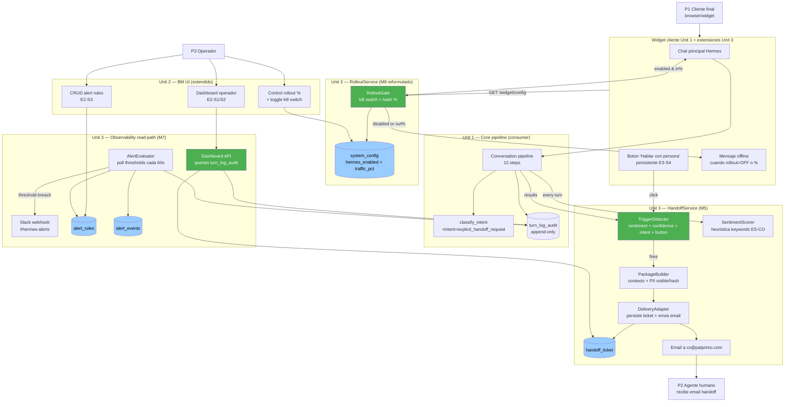
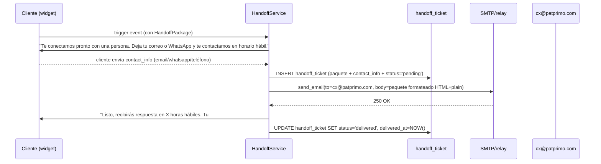
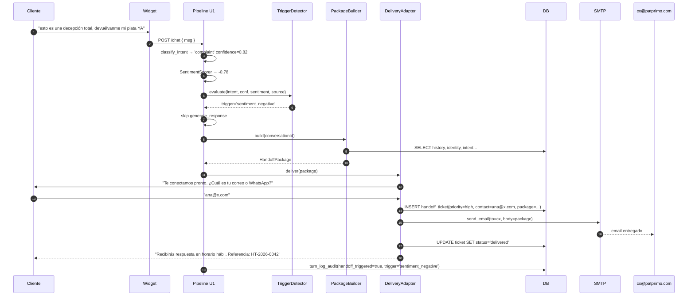

# Business Logic Model — Unit 3: Handoff & Despliegue Gradual

> **Scope**: 8 stories agrupadas en 4 dominios: (a) handoff humano (E3-S1..S4), (b) despliegue gradual con kill switch + dark launch (E4-S2 reformulada), (c) dashboards de operador (E2-S1..S2), (d) alertas (E2-S3).
> **Plan Q&A**: Q1=A heurística keywords, Q2=A stub+email, Q3=A queries directas, Q4=B Slack webhook, Q5=C kill switch + dark launch, Q6=C extender classify_intent.
> **Reformulaciones aplicadas (2026-05-25, Oct8ne validado OUT)**: E3-S3 ya no transfiere a widget Oct8ne; E4-S2 ya no es A/B Hermes vs Oct8ne. Ver `aidlc-docs/blockers/oct8ne-validation-pending.md`.

---

## 1. Big picture



---

## 2. Workflow A — Detección de triggers de handoff (E3-S1, E3-S4)

Cada turno del usuario en el pipeline de Unit 1 atraviesa el `TriggerDetector` antes de producir respuesta del bot. El detector consulta 4 señales y dispara handoff si alguna se cumple:

```text
Turn(userMessage) ─┐
                   ├─▶ sentimentScore = SentimentScorer.score(userMessage)
                   ├─▶ intent, confidence = classify_intent.run(userMessage)
                   ├─▶ buttonClicked = (source === 'handoff_button')
                   └─▶ failureCount = ConversationState.consecutive_low_confidence_turns

TriggerDecision = match(
  sentimentScore < -0.5            → trigger='sentiment_negative'
  intent IN {return_request, complaint, complex_search} → trigger='out_of_scope_intent'
  intent === 'explicit_handoff_request'                  → trigger='explicit_request'
  buttonClicked === true                                  → trigger='button_click'
  confidence < 0.6 AND failureCount >= 1                  → trigger='low_confidence'
  else                                                    → null (no handoff)
)
```

**Orden de evaluación**: button > explicit > sentiment > out_of_scope_intent > low_confidence. Solo dispara el primero que matchee (no se concatenan triggers).

**Acción al disparar**:
1. Marca el turn con `handoff_triggered=true` y `handoff_trigger=<tipo>` en `turn_log_audit`.
2. Saltea la generación de respuesta del bot (la pipeline NO produce respuesta para ese turn).
3. Invoca `PackageBuilder.build(conversationId)`.
4. Envía al cliente el mensaje del Workflow C (stub).

**Source del button click (E3-S4)**: el frontend manda un evento POST con `source: 'handoff_button'` adjunto al mensaje. El pipeline lo reconoce y bypasea sentiment/confidence — es un trigger duro.

---

## 3. Workflow B — Construcción del paquete de contexto (E3-S2)

`PackageBuilder.build(conversationId)` devuelve un `HandoffPackage` (value object) con campos del PRD §7 J4:

| Campo | Fuente | Notas |
|---|---|---|
| `customer_id_hash` | `ConsentLog.customer_id_hash` si consentido; null si guest | Hash sha256 con sal global (Unit 1 lib hashing) |
| `customer_email` | `ConsentLog.customer_email` o input del cliente en el handoff | Visible al agente humano; **NO** se persiste en logs en cleartext |
| `demografia_minima` | Country + locale + brand | Solo los 3 datos; sin más |
| `historico_pedidos` | Llamada in-line a `M3 SFCC.getOrderHistory(customerIdHash, limit=5)` | Si SFCC no responde en 3s, paquete trae `historico=[]` con flag `sfcc_timeout=true` |
| `intencion_clasificada` | Última `classify_intent.result.intent` | + confidence |
| `sentimiento_score` | Última `SentimentScorer.score` | -1..1 |
| `mensaje_cliente` | `userMessage` del turn que disparó | Texto completo |
| `intento_del_bot` | Último response del bot **antes** del trigger (si hubo) | Null si el handoff disparó en el primer turn |
| `categoria_sugerida` | Mapping `trigger → categoria` (ej. `sentiment_negative → 'queja'`) | Tabla `handoff_category_map` seed |
| `conversation_transcript_url` | Link al BM UI con drill-down filtrado por conversationId | Solo usable internamente (autenticado) |

**Validación pre-delivery**: si falta `mensaje_cliente` o `trigger`, el paquete se rechaza, el handoff falla con error 5xx interno, y el cliente recibe mensaje "estamos teniendo un problema técnico, intenta en unos minutos" (E3-S2 escenario 3). Alerta `package_incomplete` se dispara automáticamente.

---

## 4. Workflow C — Delivery stub + email (E3-S3 reformulada)

Sin Oct8ne activo, el delivery del handoff es asíncrono vía email. Pasos:



**Si SMTP falla** (retry según `withRetry` Unit 1 lib, 3 intentos backoff exp): se persiste el ticket con `status='delivery_failed'`, se dispara alerta crítica al operador, y el cliente recibe mensaje "ya tomamos tu consulta, un asesor te contactará por correo".

**Horario hábil**: Configurable en `system_config.handoff_business_hours_cron` (default 8am–6pm L–S Bogotá). Fuera de horario, el mensaje al cliente es "te respondemos el próximo día hábil" (E3-S3 escenario 2).

**Ticket priorizado** (E3-S3 escenario 2): el `handoff_ticket` lleva campo `priority` derivado del trigger — `sentiment_negative` y `complaint` → `high`; otros → `normal`. CX ve la cola ordenada en el email (asunto del email incluye `[ALTA]` o `[NORMAL]`).

---

## 5. Workflow D — Gradual rollout decision (E4-S2 reformulada)

Cada request al widget pasa primero por `RolloutGate.shouldServeHermes(sessionId, customerIdHash?)`. Solo si retorna `true` se levanta el chat de Hermes:

```text
shouldServeHermes(sessionId, customerIdHash):
  config = SystemConfigRepo.get()  // cached 60s in-memory

  // Kill switch absoluto: override total
  if config.hermes_enabled === false:
    log.event('rollout_skipped', { reason: 'kill_switch_off' })
    return false

  // Dark launch determinístico
  identifier = customerIdHash ?? sessionId
  bucket = hash_sha256(identifier + config.rollout_salt) % 100

  if bucket < config.hermes_traffic_percentage:
    log.event('rollout_admitted', { bucket, threshold: config.hermes_traffic_percentage })
    return true
  else:
    log.event('rollout_excluded', { bucket, threshold: config.hermes_traffic_percentage })
    return false
```

**Determinismo**: el mismo `customerIdHash` siempre cae en el mismo bucket → mismo cliente recurrente ve consistentemente Hermes (o no) cross-session. Guests usan `sessionId` (random pero estable durante la sesión).

**Cambios de config sin redeploy**: el operador edita `system_config` vía BM UI (extensión Unit 2). El cache de 60s asegura que un cambio se propaga en ≤60s sin invalidación explícita.

**Mensaje cuando RolloutGate retorna false**: widget muestra "Atención por correo en horario hábil: cx@patprimo.com" + botón "Dejar un mensaje" que abre el flujo de handoff offline. NO levanta chat de IA.

**Defaults seed**: `hermes_enabled=true`, `hermes_traffic_percentage=0`, `rollout_salt=<random 32 bytes>`. Al inicio de Demo Day, operador sube manualmente a 5% → 25% → 100% según gates del PRD §13.

---

## 6. Workflow E — Dashboard query strategy (E2-S1, E2-S2)

Q3=A: queries directas a `turn_log_audit` con índices `(timestamp, conversation_id)` ya planeados en Unit 1.

**KPIs principales del dashboard** (E2-S1, 6 KPIs):

| KPI | Query (esquema simplificado) | Refresh |
|---|---|---|
| Tiempo 1ª respuesta p50/p95 | `SELECT percentile_cont(0.5/0.95) WITHIN GROUP (ORDER BY first_response_ms) FROM turn_log_audit WHERE turn_index=0 AND created_at > now() - interval '24h'` | On-demand cada page load |
| Costo unitario por consulta | `SELECT AVG(tokens_in * cost_in + tokens_out * cost_out) FROM turn_log_audit WHERE created_at > now() - interval '24h'` | On-demand |
| % conversiones (proxy: cliente clickó add-to-cart post-recomendación) | `SELECT COUNT(*) FILTER (WHERE add_to_cart=true) / NULLIF(COUNT(*),0) FROM ...` | On-demand |
| CSAT promedio | `SELECT AVG(csat_score) FROM turn_log_audit WHERE csat_score IS NOT NULL ...` | On-demand |
| % escalamientos | `SELECT COUNT(*) FILTER (WHERE handoff_triggered=true) / COUNT(*) FROM ...` | On-demand |
| Guardrail violations | `SELECT COUNT(*) FROM turn_log_audit WHERE guardrail_violated=true ...` | On-demand |

**Drill-down (E2-S2)**: lista paginada con filtros por rango de fecha + intent + trigger. Endpoint `GET /admin/escalations?from=&to=&intent=&trigger=`. Cada fila muestra conversation_id, timestamp, intent, trigger, sentiment. Click → vista completa de turns (incluye tool calls + paquete handoff + estado del ticket).

**Vista de conversación completa**: une `turn_log_audit` + `handoff_ticket` por `conversation_id`. La transcripción muestra cada turn con `userMessage`, `botResponse`, `intent`, `confidence`, `sentiment`, `guardrail_status`, tool calls (de un JSONB column en turn_log_audit). El paquete handoff aparece como un "card" al final si la conversación fue escalada.

**Codificación visual de salud** (E2-S1 escenario 2): cada KPI compara valor actual con target del PRD §10; deriva color: dentro de target → verde; en banda de alerta (±20% del target) → amarillo; fuera → rojo. Flecha de tendencia: compara última hora vs hora previa.

**Performance budget**: cada query del dashboard debe completar en <500ms p95 para mantener carga total <3s (E2-S1 escenario 1). Con MVP volume estimado <1000 conversaciones/día, índices propuestos en Unit 1 §5 deben dar sub-segundo sin tuning.

---

## 7. Workflow F — Alerting (E2-S3)

Q4=B: un único canal Slack webhook. Reglas configurables desde BM UI; evaluación poll-based cada 60s.

```text
AlertEvaluator (background job, cron */1):
  for each rule in alert_rules WHERE active=true:
    actual_value = evaluate_metric(rule.metric, rule.window)
    if compare(actual_value, rule.operator, rule.threshold):
      if NOT throttled(rule.rule_id, rule.cooldown_minutes):
        emit_event(rule, actual_value)
        post_to_slack(rule, actual_value)
        record_alert_event(rule, actual_value, dispatched_at=NOW())
```

**Reglas built-in al seed** (no requieren configuración del operador):
- `1ª respuesta p95 > 90s durante 10 min consecutivos` → alerta
- `Guardrail violation` (cualquier evento) → alerta inmediata + tag P5 Compliance
- `Circuit breaker abierto >2 min` → alerta crítica
- `Handoff package_incomplete` → alerta inmediata
- `Email delivery failure rate > 5% durante 1h` → alerta

**Reglas custom**: operador puede crear vía BM UI con campos: metric (enum), window (minutes), operator (>, <, >=, <=, ==), threshold (number), cooldown_minutes (default 15), channel (Slack only en MVP).

**Throttling**: cada `rule_id` tiene cooldown_minutes; si se disparó hace menos tiempo del cooldown, no se vuelve a notificar pero sí se registra en `alert_events` (visible en dashboard).

**Payload Slack**: texto plano con resumen + link al dashboard pre-filtrado. Ejemplo:
```text
[Hermes] Alerta: 1ª respuesta p95 = 110s (umbral: 90s)
Ventana: últimos 10 min · Severidad: medium
Link: https://hermes.internal/dashboard?from=...&to=...&filter=latency
```

**Sin Slack configurado**: si `SLACK_WEBHOOK_URL` env var está vacío, las alertas se loguean con `pino.warn` a stdout (graceful degradation). El operador ve los eventos en `alert_events` desde el BM UI.

---

## 8. Integración con Units 1 y 2

### Con Unit 1 (consumer del pipeline)
- `classify_intent` extiende su enum con `'explicit_handoff_request'` (Q6=C). El catálogo de intents se ajusta en el prompt del LLM clasificador; coste marginal cero.
- `turn_log_audit` recibe columnas nuevas: `handoff_triggered` (bool), `handoff_trigger` (enum), `sentiment_score` (numeric), `guardrail_violated` (bool — ya existía implícito, ahora explícito), `add_to_cart` (bool — para KPI conversión).
- El pipeline gana 2 steps después de `classify_intent`: `step.sentiment_score` y `step.trigger_decision`. Si `trigger_decision != null`, salta `step.generate_response` y entra a `step.handoff`.

### Con Unit 2 (BM UI)
- Extiende la BM UI con 3 secciones nuevas: Rollout Control (kill switch + traffic %), Dashboard Operador (KPIs + drill-down), Alert Rules CRUD.
- Reusa el sistema de auth de Unit 2 (BrandManagerUser + JWT); rol `operator` accede a Rollout, Dashboard, Alerts; rol `brand_manager` accede solo a brand config (Unit 2 alcance original).

### Externals
- **SMTP relay**: en MVP local-only Docker Compose, se usa contenedor `mailhog` para capturar emails (no se envían reales). En Fase 2, configurar SMTP corporativo. Env var `SMTP_HOST`, `SMTP_PORT`, `SMTP_FROM`.
- **Slack incoming webhook**: 1 webhook único en `#hermes-alerts` (canal interno PASH). Env var `SLACK_WEBHOOK_URL`.

---

## 9. Diagrama de secuencia: handoff end-to-end



---

## 10. Out of scope (Fase 2 candidates)

- WhatsApp Business Cloud API como canal síncrono (Q2 opción B).
- Widget propio con vista de agente humano (Q2 opción C).
- Salesforce Service Cloud integration (Q2 opción D + OD pendiente).
- Materialized views o snapshot tables para dashboard (Q3 opciones B/C).
- SMTP redundante + PagerDuty (Q4 opciones C/D).
- LLM-based sentiment scoring (Q1 opción C/D).
- Fuzzy matching para explicit handoff (Q6 opción B).
