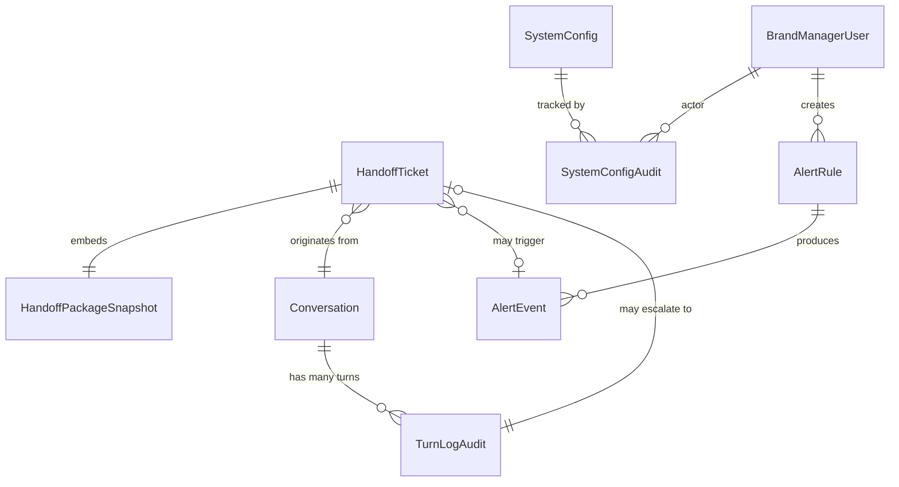

# Domain Entities — Unit 3: Handoff & Despliegue Gradual

> **Scope**: entidades nuevas de Unit 3 + extensiones a `turn_log_audit` de Unit 1 + reuso de `BrandManagerUser` de Unit 2.

---

## 1. Entity overview



> `Conversation` y `TurnLogAudit` ya existen desde Unit 1 — Unit 3 las consume y extiende. `BrandManagerUser` viene de Unit 2.

---

## 2. Entity: HandoffTicket

**Purpose**: representa una sesión que disparó handoff. Cada ticket es una unidad de trabajo entregable a CX.

| Attribute | Type | Notes |
|---|---|---|
| `ticket_id` | UUID | PK; inmutable |
| `ticket_short_id` | string | Formato `HT-{año}-{secuencial-4-dígitos}` (ej. `HT-2026-0042`); único; visible al cliente |
| `conversation_id` | UUID | FK → `conversations.conversation_id` (Unit 1) |
| `brand` | BrandId | `"patprimo"` en MVP |
| `trigger` | enum | `button_click` \| `explicit_request` \| `sentiment_negative` \| `out_of_scope_intent` \| `low_confidence` |
| `priority` | enum | `high` \| `normal` (derivado del trigger según R-HOD-5) |
| `status` | enum | `pending` \| `awaiting_contact` \| `delivered` \| `delivery_failed` \| `delivery_failed_breaker` \| `package_invalid` |
| `contact_info` | string \| null | Email o teléfono que dio el cliente (cleartext); null si no proveyó |
| `contact_kind` | enum \| null | `email` \| `phone` \| `not_provided` |
| `package_audit` | JSONB | Snapshot del HandoffPackage con PII hasheada (audience='audit') |
| `degraded_fields` | JSONB array | Lista de campos opcionales faltantes (ej. `["historico_pedidos","identity"]`) |
| `email_message_id` | string \| null | Message-ID del email enviado (para correlacionar bounces en Fase 2) |
| `created_at` | Iso8601 | inmutable |
| `delivered_at` | Iso8601 \| null | populado al `status='delivered'` |
| `closed_at` | Iso8601 \| null | populado cuando CX cierra el ticket (Fase 2 — MVP no tiene workflow de cierre) |

**Invariantes:**
- `status = "delivered"` ⟹ `delivered_at IS NOT NULL` AND `email_message_id IS NOT NULL`.
- `status IN ('package_invalid')` ⟹ `package_audit IS NOT NULL` (se guarda incluso si invalido, para auditoría).
- `ticket_short_id` único en toda la tabla; secuencial por año.
- `contact_info` se almacena cleartext PORQUE CX lo necesita; el `package_audit` lleva versión hasheada. R-HO-10.

**Índices**:
- `(conversation_id)` para join con `turn_log_audit`.
- `(status, created_at)` para drill-down operacional.
- `(brand, priority, status, created_at DESC)` para cola de CX (cuando se construya UI Fase 2).
- `UNIQUE (ticket_short_id)`.

**Append-only behavior**: la fila se inserta con `status='pending'` y solo los campos `status`, `delivered_at`, `email_message_id`, `closed_at` se actualizan. El `package_audit`, `trigger`, `priority`, `contact_info` NUNCA se mutan.

---

## 3. Value Object: HandoffPackage

**Purpose**: payload de contexto que viaja del `PackageBuilder` al `DeliveryAdapter`. NO se persiste como tal — su forma "audit" se serializa dentro de `HandoffTicket.package_audit`; su forma "email" se renderiza en el email a CX y se descarta.

| Field | Type | Audience email | Audience audit |
|---|---|---|---|
| `trigger` | enum | ✅ | ✅ |
| `mensaje_cliente` | string | ✅ cleartext | ✅ cleartext (no es PII) |
| `intencion_clasificada` | string | ✅ | ✅ |
| `intencion_confidence` | number [0,1] | ✅ | ✅ |
| `sentimiento_score` | number [-1,1] | ✅ | ✅ |
| `categoria_sugerida` | string | ✅ | ✅ |
| `intento_del_bot` | string \| null | ✅ | ✅ |
| `customer_id_hash` | string \| null | ✅ | ✅ |
| `customer_email` | string \| null | ✅ **cleartext** | 🔒 hash sha256 |
| `customer_phone` | string \| null | ✅ **cleartext** | 🔒 hash sha256 |
| `demografia_minima` | object \| null | ✅ | ✅ |
| `historico_pedidos` | array | ✅ con order_ids cleartext | 🔒 order_ids hasheados |
| `degraded_fields` | string[] | ✅ | ✅ |
| `conversation_transcript_url` | string | ✅ | ✅ |

**Serialización**: `PackageBuilder.serialize(pkg, audience: 'email' | 'audit')` devuelve dos representaciones distintas. La capa de email recibe la audience='email'; el repo de `handoff_ticket` recibe audience='audit'.

**Validation**: `validatePackage(pkg)` retorna `{valid: bool, missing: string[]}`. Campos obligatorios (R-HO-8): `trigger`, `mensaje_cliente`, `intencion_clasificada`, `sentimiento_score`, `categoria_sugerida`, `conversation_transcript_url`.

---

## 4. Entity: SystemConfig

**Purpose**: configuración global runtime. Single-row table (siempre 1 fila, `id=1`).

| Attribute | Type | Notes |
|---|---|---|
| `id` | int | PK; constante `1`; constraint `CHECK (id = 1)` |
| `hermes_enabled` | bool | Kill switch global (R-ROLL-1) |
| `hermes_traffic_percentage` | int | 0..100; CHECK constraint |
| `rollout_salt` | bytea | 32 bytes random; cambiar redistribuye buckets |
| `handoff_stub_message` | text | Texto enviado al cliente al iniciar handoff (R-HOD-1); default seed |
| `handoff_business_hours_cron` | string | Expresión cron-like; default `"0 8-18 * * 1-6 America/Bogota"` |
| `slack_webhook_url` | string \| null | NULL = alertas a stdout only (R-ALERT-1) |
| `smtp_host` | string | Default `"mailhog"` en MVP local |
| `smtp_port` | int | Default `1025` (mailhog) |
| `smtp_from` | string | Default `"hermes@patprimo.local"` |
| `updated_at` | Iso8601 | actualizado on cualquier UPDATE |

**Cache**: `SystemConfigRepo.get()` cachea in-memory por 60s (R-ROLL-5).

**Invariantes:**
- `hermes_traffic_percentage` ∈ [0, 100].
- `rollout_salt` se setea en migración inicial; cambios subsiguientes son intencionales y auditados.

---

## 5. Entity: SystemConfigAudit

**Purpose**: registro append-only de cada cambio a `SystemConfig`. R-ROLL-6.

| Attribute | Type | Notes |
|---|---|---|
| `audit_id` | UUID | PK |
| `actor_user_id` | UUID | FK → `brand_manager_users.user_id` (Unit 2) |
| `field_name` | string | nombre de columna modificada |
| `old_value` | text | JSON string del valor previo |
| `new_value` | text | JSON string del valor nuevo |
| `reason` | text | Razón provista por el operador (mandatory si severity='high', opcional si no) |
| `changed_at` | Iso8601 | inmutable |

**Índices**: `(changed_at DESC)`, `(actor_user_id, changed_at DESC)`.

**Behavior**: append-only. Nunca UPDATE/DELETE. Cada UPDATE a `SystemConfig` desde la BM UI dispara un INSERT aquí (mismo TX).

---

## 6. Entity: AlertRule

**Purpose**: regla configurable de monitoreo evaluada cada 60s. Mezcla seed built-in + custom del operador.

| Attribute | Type | Notes |
|---|---|---|
| `rule_id` | UUID | PK |
| `name` | string | Único per-active rule; mostrado en alertas |
| `is_builtin` | bool | true para reglas seed; no se pueden borrar |
| `metric` | enum | `latency_p95` \| `latency_p50` \| `cost_per_query` \| `escalation_rate` \| `csat_avg` \| `guardrail_violation_count` \| `package_incomplete_count` \| `email_delivery_failure_rate` |
| `window_minutes` | int | 1..1440 |
| `operator` | enum | `>` \| `<` \| `>=` \| `<=` \| `==` |
| `threshold` | numeric | comparado contra `metric` evaluado en `window_minutes` |
| `cooldown_minutes` | int | default 15; 1..720 |
| `severity` | enum | `low` \| `medium` \| `high` \| `critical` |
| `active` | bool | default true |
| `created_by_user_id` | UUID \| null | FK → `brand_manager_users.user_id`; null para builtin |
| `created_at` | Iso8601 | inmutable |
| `updated_at` | Iso8601 | actualizado on cambios |

**Invariantes:**
- `is_builtin=true` ⟹ no se permite DELETE; solo UPDATE de `active`, `threshold`, `window_minutes`, `cooldown_minutes`.
- `is_builtin=false` ⟹ `created_by_user_id IS NOT NULL`.

**Seed (R-ALERT-2)**: la migración inicial inserta 5 reglas con `is_builtin=true` (definidas en business-rules §7).

---

## 7. Entity: AlertEvent

**Purpose**: log append-only de cada disparo de regla (sea o no notificado por throttling).

| Attribute | Type | Notes |
|---|---|---|
| `event_id` | UUID | PK |
| `rule_id` | UUID | FK → `alert_rules.rule_id` |
| `actual_value` | numeric | valor medido al disparar |
| `notified` | bool | true si pasó throttling y se mandó a Slack; false si quedó silenciado |
| `slack_status` | enum \| null | `ok` \| `failed` \| `no_webhook_configured`; null si `notified=false` |
| `triggered_at` | Iso8601 | inmutable |
| `cooldown_until` | Iso8601 \| null | si notified=true, hasta cuándo se silencia esta `rule_id` |

**Índices**:
- `(rule_id, triggered_at DESC)` — para histórico per-rule.
- `(triggered_at DESC)` — para feed global de alertas en BM UI.
- `(notified, triggered_at DESC)` — para distinguir "disparadas" vs "notificadas".

---

## 8. Extensión: TurnLogAudit (entidad Unit 1)

Unit 3 agrega columnas a `turn_log_audit`. Migración alter table (no breaking — campos nullable):

| Columna nueva | Type | Default | Notas |
|---|---|---|---|
| `handoff_triggered` | bool | false | true sii el turn disparó handoff |
| `handoff_trigger` | enum nullable | null | mismo enum que `HandoffTicket.trigger`; null si no hubo |
| `sentiment_score` | numeric(4,3) nullable | null | -1.000 a 1.000; null si no se calculó |
| `add_to_cart` | bool | false | true sii el cliente clickó add-to-cart en ese turn (para KPI conversión) |
| `guardrail_violated` | bool | false | reemplaza/explicita el campo implícito de Unit 1 |

**Índices nuevos**:
- `(handoff_triggered, created_at DESC)` para filtrar drill-down rápidamente.
- `(handoff_trigger, created_at DESC)` parcial `WHERE handoff_triggered=true` para queries de E2-S2 por trigger.

---

## 9. Reference data: handoff_category_map (seed)

**Purpose**: mapping `trigger → categoria_sugerida` usado por `PackageBuilder`. No es tabla propiamente (es JSON seed cargado al boot).

```json
{
  "button_click":         "consulta_humana",
  "explicit_request":     "consulta_humana",
  "sentiment_negative":   "queja",
  "out_of_scope_intent":  "devolucion_o_cambio",
  "low_confidence":       "consulta_compleja"
}
```

Cambios requieren PR + redeploy en MVP. Fase 2: CRUD desde BM UI.

---

## 10. Reference data: sentiment_lexicon_es_co.json (seed)

**Purpose**: lista de keywords negativos ES-CO con peso y categoría. R-SENT-2.

```json
[
  { "keyword": "decepcionado", "weight": -0.5, "category": "frustración" },
  { "keyword": "molesto",      "weight": -0.4, "category": "frustración" },
  { "keyword": "horrible",     "weight": -0.6, "category": "extremo" },
  { "keyword": "pésimo",       "weight": -0.6, "category": "extremo" },
  { "keyword": "queja",        "weight": -0.5, "category": "intento_handoff" },
  { "keyword": "exigir",       "weight": -0.4, "category": "intento_handoff" },
  { "keyword": "estafa",       "weight": -0.8, "category": "extremo" },
  { "keyword": "robo",         "weight": -0.8, "category": "extremo" },
  { "keyword": "nunca más",    "weight": -0.6, "category": "intento_handoff" },
  { "keyword": "terrible",     "weight": -0.6, "category": "extremo" }
]
```

**Carga**: al boot, cargado en memoria (~10 keywords ahora, esperado <100 en Fase 2). Match case-insensitive + acento-insensitive (uso `normalize('NFD').replace(/[̀-ͯ]/g, '')`).

---

## 11. Migrations summary (orden propuesto)

| Migration | Descripción |
|---|---|
| `005_system_config.sql` | CREATE TABLE `system_config` + seed row con defaults |
| `006_system_config_audit.sql` | CREATE TABLE `system_config_audit` + índices |
| `007_handoff_ticket.sql` | CREATE TABLE `handoff_ticket` + secuencia para `ticket_short_id` + índices |
| `008_alert_rules.sql` | CREATE TABLE `alert_rules` + seed de 5 reglas builtin |
| `009_alert_events.sql` | CREATE TABLE `alert_events` + índices |
| `010_turn_log_audit_extend.sql` | ALTER TABLE `turn_log_audit` ADD `handoff_triggered`, `handoff_trigger`, `sentiment_score`, `add_to_cart`, `guardrail_violated`; CREATE indexes |

Las migraciones 005..010 corren después de las 001..004 de Unit 1 y se mantienen append-only (sin DROP/RENAME) — esto preserva el principio de Unit 1 NFR Design sobre migrations forward-only.

---

## 12. Out of scope (Fase 2)

- Tabla `handoff_workflow_state` para tracking del ciclo de vida del ticket en CX (asignado → en_atención → resuelto → cerrado).
- Integración con WhatsApp Business Cloud API → tabla `whatsapp_session`.
- Snapshot tables `kpi_snapshots` para dashboards de gran escala.
- Tabla `handoff_category_map` editable + `sentiment_lexicon` editable desde BM UI.
- Métricas de SLA por agente humano (AHT, FCR) — depende de que el ciclo de cierre del ticket exista.
