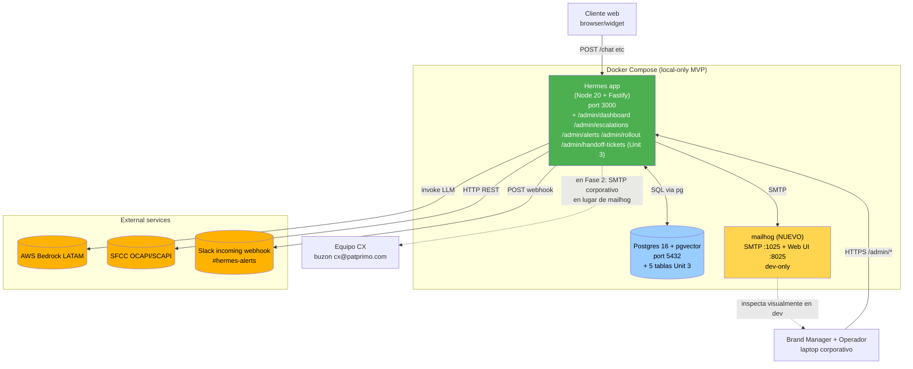

# Logical Components — Unit 3: Handoff & Despliegue Gradual

> **Scope**: delta vs Units 1 y 2 — 1 contenedor nuevo (mailhog dev-only) + nuevos services/repos/plugins/controllers/jobs dentro del mismo proceso Fastify.

---

## 1. Topology — delta vs Unit 2



**Adiciones a Docker Compose vs Unit 2**:
1. **mailhog service** (dev-only) — captura emails para inspección via web UI `http://localhost:8025`. En Fase 2 con SMTP corporativo, este servicio se quita del compose y se cambia env vars `SMTP_HOST/PORT/SECURE`.
2. Sin cambios al servicio `app` (mismo container, mismo proceso Node).
3. Sin cambios al servicio `postgres`.

**Sin Redis, sin queue, sin worker container** (Q1 NFR-R = A — `node-cron` in-process).

---

## 2. Components nuevos dentro de la Hermes app (delta Unit 3)

### 2.1 Nuevos services

| Service | Lives in | Implements |
|---|---|---|
| `SentimentScorer` | `services/sentiment-scorer.service.ts` | `score(text): number` — función pura sobre lexicon inyectado (PBT) |
| `TriggerDetector` | `services/trigger-detector.service.ts` | `evaluate(ctx): TriggerDecision \| null` — orden estricto 5 triggers (R-HO-1) |
| `PackageBuilder` | `services/package-builder.service.ts` | `build(conversationId): HandoffPackage`; serializa con `audience` separation (R-HO-10) |
| `DeliveryAdapter` | `services/delivery-adapter.service.ts` | `deliver(ticket, pkg)` — INSERT ticket → render email → SMTP send con retry+breaker |
| `HandoffService` | `services/handoff.service.ts` | Orquesta TriggerDetector → PackageBuilder → DeliveryAdapter; aplica R-HO-7 (idempotencia) |
| `RolloutGate` | `services/rollout-gate.service.ts` | `shouldServeHermes(identifier): boolean` — usa SystemConfigRepo (cached) |
| `SystemConfigService` | `services/system-config.service.ts` | Wraps SystemConfigRepo + valida `reason` obligatorio (R-ROLL-6); audit insert en TX |
| `AlertEvaluator` | `services/alert-evaluator.service.ts` | `tick()` — single advisory lock + eval secuencial reglas (Q4=A) |
| `MetricsCalculator` | `services/metrics-calculator.service.ts` | `compute(metric, windowMinutes)` — SQL agregadas sobre `turn_log_audit` para dashboards y alertas |
| `EmailRenderer` | `services/email-renderer.ts` | Funciones puras: `renderHandoffEmailHtml/Text/Subject` (Q5=A) |

### 2.2 Nuevos adapters (libs)

| Adapter | Lives in | Encapsula |
|---|---|---|
| `SmtpAdapter` | `lib/adapters/smtp.ts` | nodemailer transporter; wrapped en `withRetry + withCircuitBreaker` en composition root |
| `SlackAdapter` | `lib/adapters/slack.ts` | undici-based webhook POST; wrapped en `withRetry` |
| `TtlCache<K,V>` | `lib/ttl-cache.ts` | Cache genérico in-memory con TTL — usado por `SystemConfigRepo` (Q2=A) |

### 2.3 Nuevos plugins Fastify

| Plugin | Lives in | Propósito |
|---|---|---|
| `role-guard.plugin.ts` | `plugins/role-guard.plugin.ts` | `requireRole(['operator','admin'])` decorator (Q4 NFR-R) |
| `m5-handoff.plugin.ts` | `plugins/m5-handoff.plugin.ts` | Integra `HandoffService` en el pipeline de `/chat` (después de `classify_intent`) |
| `m7-dashboard.plugin.ts` | `plugins/m7-dashboard.plugin.ts` | Routes `/admin/dashboard/*` |
| `m7-escalations.plugin.ts` | `plugins/m7-escalations.plugin.ts` | Routes `/admin/escalations/*` (drill-down + vista de conversación) |
| `m7-alerts.plugin.ts` | `plugins/m7-alerts.plugin.ts` | Routes `/admin/alerts/*` (CRUD alert_rules + GET alert_events) |
| `m8-rollout.plugin.ts` | `plugins/m8-rollout.plugin.ts` | Routes `/admin/rollout/*` (kill switch + traffic %); solo `admin` role |
| `m5-handoff-tickets.plugin.ts` | `plugins/m5-handoff-tickets.plugin.ts` | Routes `/admin/handoff-tickets/*` (listing + detalle) |

### 2.4 Nuevos repositories

| Repo | Lives in |
|---|---|
| `HandoffTicketRepo` | `repositories/handoff-ticket.repo.ts` |
| `SystemConfigRepo` | `repositories/system-config.repo.ts` (con TtlCache 60s) |
| `SystemConfigAuditRepo` | `repositories/system-config-audit.repo.ts` |
| `AlertRulesRepo` | `repositories/alert-rules.repo.ts` |
| `AlertEventsRepo` | `repositories/alert-events.repo.ts` |
| `TurnLogQueryRepo` | `repositories/turn-log-query.repo.ts` (read-path complement al write-path U1) |

### 2.5 Nuevos controllers (routes /admin/*)

| Controller | Routes principales |
|---|---|
| `dashboard.controller.ts` | `GET /admin/dashboard/kpis` (6 KPIs) |
| `escalations.controller.ts` | `GET /admin/escalations` (paginado, filtros), `GET /admin/conversations/:id` (vista completa) |
| `alerts.controller.ts` | `GET/POST /admin/alerts/rules`, `PATCH /admin/alerts/rules/:id`, `GET /admin/alerts/events` |
| `rollout.controller.ts` | `GET /admin/rollout/config`, `PATCH /admin/rollout/traffic-percentage`, `PATCH /admin/rollout/kill-switch` |
| `handoff-tickets.controller.ts` | `GET /admin/handoff-tickets`, `GET /admin/handoff-tickets/:id` |
| `widget-config.controller.ts` (nuevo, no-/admin) | `GET /widget/config` — invoca RolloutGate para decisión |

### 2.6 Nuevos jobs (registrados en mismo `job-runner.ts` de Units 1+2)

| Job | Schedule | Lives in |
|---|---|---|
| `alert-evaluator.job` | `*/1 * * * *` (cada 60s, node-cron) | `jobs/alert-evaluator.job.ts` |

**Sin jobs adicionales** — cleanup retention de `alert_events` y `system_config_audit` queda Fase 2 (TD-U3-12).

### 2.7 Extensiones a EJS views de Unit 2 (BM UI)

| Template | Renderea |
|---|---|
| `views/admin/dashboard.ejs` (nueva) | Operator dashboard con 6 KPIs (E2-S1) |
| `views/admin/escalations.ejs` (nueva) | Drill-down list (E2-S2) |
| `views/admin/conversation-detail.ejs` (nueva) | Transcripción completa + paquete handoff (E2-S2) |
| `views/admin/alerts.ejs` (nueva) | CRUD alert rules + feed alert_events (E2-S3) |
| `views/admin/rollout.ejs` (nueva) | Kill switch toggle + traffic % slider + audit log (E4-S2 reformulado) |
| `views/admin/handoff-tickets.ejs` (nueva) | Cola de tickets (Fase 2 expandible) |
| `views/_partials/kpi-card.ejs` (nueva) | KPI tile con color de banda |
| `views/_partials/handoff-package.ejs` (nueva) | Render del paquete dentro de conversation-detail |

### 2.8 Extensión al widget cliente de Unit 1

| Componente | Lives in (frontend Unit 1) | Cambio |
|---|---|---|
| `widget/handoff-button.js` (nuevo) | `widget/src/handoff-button.js` | Botón "Hablar con persona" persistente (E3-S4); a11y WCAG AA |
| `widget/offline-fallback.js` (nuevo) | `widget/src/offline-fallback.js` | UI cuando RolloutGate retorna false (formulario email + mensaje) |
| `widget/chat-ui.js` (extendido) | `widget/src/chat-ui.js` | Reconoce mensaje stub de handoff (R-HOD-1) y muestra captura de contact_info (R-HOD-2) |
| `widget/index.js` (extendido) | `widget/src/index.js` | Llama `GET /widget/config` al bootstrap para decidir si renderizar chat o offline-fallback |

### 2.9 Assets estáticos nuevos

| File | Path |
|---|---|
| `widget-handoff-button.css` | `widget/dist/widget-handoff-button.css` |
| `dashboard.css` | `static/admin/dashboard.css` (KPI tile colors, etc.) |

### 2.10 Reference data files (nuevos)

| File | Path |
|---|---|
| Sentiment lexicon ES-CO | `prompts/sentiment_lexicon_es_co.json` |
| Handoff category map | `prompts/handoff_category_map.json` |

---

## 3. Composition root wiring (delta)

```ts
// hermes/src/composition.ts (extensión)

// --- Adapters externos
const smtpAdapter = new SmtpAdapter(
  nodemailer.createTransport({ host: env.SMTP_HOST, port: env.SMTP_PORT, secure: env.SMTP_SECURE }),
  env.SMTP_FROM,
);
const resilientSmtpSend = withCircuitBreaker(
  withRetry(smtpAdapter.send.bind(smtpAdapter), { attempts: 3, baseDelayMs: 1000, backoff: 'exponential', maxDelayMs: 8000 }),
  { failureThreshold: 5, openDurationMs: 60_000, halfOpenSuccessesToClose: 1, name: 'smtp' },
);

const slackAdapter = new SlackAdapter(env.SLACK_WEBHOOK_URL ?? null);
const resilientSlackPost = withRetry(slackAdapter.post.bind(slackAdapter), {
  attempts: 3, baseDelayMs: 500, backoff: 'exponential', maxDelayMs: 4000,
});

// --- Reference data al boot (fail-fast)
const lexicon = loadLexicon();  // §5.1 del nfr-design-patterns.md
const categoryMap = loadCategoryMap();

// --- Repositories
const handoffTicketRepo = new HandoffTicketRepo(pg);
const systemConfigRepo = new SystemConfigRepo(pg);  // ya viene con TtlCache 60s embebido
const systemConfigAuditRepo = new SystemConfigAuditRepo(pg);
const alertRulesRepo = new AlertRulesRepo(pg);
const alertEventsRepo = new AlertEventsRepo(pg);
const turnLogQueryRepo = new TurnLogQueryRepo(pg);

// --- Services
const sentimentScorer = new SentimentScorer(lexicon);
const triggerDetector = new TriggerDetector(sentimentScorer);
const packageBuilder = new PackageBuilder({ sfccClient, turnLogQueryRepo, consentRepo, hashing, categoryMap });
const deliveryAdapter = new DeliveryAdapter({ smtpSend: resilientSmtpSend, handoffTicketRepo, emailRenderer });
const handoffService = new HandoffService({ triggerDetector, packageBuilder, deliveryAdapter });
const rolloutGate = new RolloutGate(systemConfigRepo);
const systemConfigService = new SystemConfigService({ systemConfigRepo, systemConfigAuditRepo });
const metricsCalculator = new MetricsCalculator(turnLogQueryRepo, handoffTicketRepo);
const alertEvaluator = new AlertEvaluator({ alertRulesRepo, alertEventsRepo, metricsCalculator, slackPost: resilientSlackPost });

// --- Plugins (registrados en orden)
await app.register(import('./plugins/role-guard.plugin'));
await app.register(import('./plugins/m5-handoff.plugin'), { handoffService });   // se inserta en el chain de /chat
await app.register(import('./plugins/m7-dashboard.plugin'), { metricsCalculator });
await app.register(import('./plugins/m7-escalations.plugin'), { turnLogQueryRepo, handoffTicketRepo });
await app.register(import('./plugins/m7-alerts.plugin'), { alertRulesRepo, alertEventsRepo });
await app.register(import('./plugins/m8-rollout.plugin'), { systemConfigService, rolloutGate });
await app.register(import('./plugins/m5-handoff-tickets.plugin'), { handoffTicketRepo });

// --- Widget config endpoint
await app.register(import('./plugins/widget-config.plugin'), { rolloutGate });

// --- Background jobs
registerAlertEvaluatorJob({ pg, alertEvaluator, logger });
```

---

## 4. Pipeline /chat — integración del HandoffService

El pipeline de Unit 1 ya tenía 12 steps; Unit 3 inserta lógica de handoff **antes** del step `generate_response`:

```text
1. validate_input
2. ensure_session
3. consent_gate
4. apply_input_guardrails
5. classify_intent             ← extendido con 'explicit_handoff_request' (Q6 FD)
6. update_conversation_state
7. compute_sentiment_score     ← NUEVO U3 (R-SENT-1)
8. evaluate_handoff_trigger    ← NUEVO U3 (R-HO-1)
9. IF trigger_fired:
     → handoffService.process(ctx)  ← skipea steps 10-12
     → return stub message + ticket short_id
   ELSE:
     → continue
10. generate_response
11. apply_output_guardrails
12. log_turn (append-only)     ← extendido con 5 columnas U3
```

---

## 5. Tests específicos a generar en Code Generation (Unit 3)

| Test file | Tipo | Cubre |
|---|---|---|
| `sentiment-scorer.pbt.test.ts` | PBT (fast-check) | Q5 NFR-R prop a/b/c/d sobre `score()` |
| `sentiment-scorer.test.ts` | Example-based | Frases ES Col reales (queja, frustración, neutro, positivo) |
| `rollout-gate.pbt.test.ts` | PBT | Determinismo, monotonía, kill switch absoluto |
| `rollout-gate.test.ts` | Example-based + cache | Cache hit/miss, invalidación tras update |
| `package-builder.test.ts` | Service | Happy path + SFCC timeout (degraded_fields) + invalid package |
| `delivery-adapter.test.ts` | Integration | Mock SMTP (nodemailer test-mode) — retry exhaustion + breaker open + success |
| `handoff.service.test.ts` | Service | Orquestación TriggerDetector → PackageBuilder → DeliveryAdapter; idempotencia R-HO-7 |
| `trigger-detector.test.ts` | Service | Orden de evaluación de 5 triggers + button bypass |
| `alert-evaluator.test.ts` | Service | tick happy + throttling + Slack retry exhausted + critical bypasses cooldown |
| `validate-package.pbt.test.ts` | PBT | Rechazo iff falta campo obligatorio |
| `email-renderer.test.ts` | Snapshot | HTML + text + subject snapshots inline |
| `system-config.repo.test.ts` | Integration | Cache invalidación + audit insert TX atomicidad |
| `m7-dashboard.controller.test.ts` | Integration (supertest) | GET /admin/dashboard/kpis con seed + role check |
| `m8-rollout.controller.test.ts` | Integration | PATCH endpoints + role=admin enforcement + reason mandatory |
| Integration end-to-end | Supertest + mailhog real | POST /chat con mensaje "decepcionado horrible" → trigger sentiment → email captured en mailhog API → ticket en DB |

Coverage target: 70% lines (heredado Unit 1 TD-U1).

---

## 6. Cambios al `package.json` (deltas)

```jsonc
{
  "dependencies": {
    "nodemailer": "^6.9.13",
    "node-cron": "^3.0.3"
  },
  "devDependencies": {
    "@types/nodemailer": "^6.4.15"
  }
}
```

Sin cambios a scripts (build/test/dev) heredados de U1/U2.

---

## 7. Cambios al `docker-compose.yml` (delta)

```yaml
services:
  app:
    # ... (sin cambios; mismo image build, mismas env vars except SMTP/SLACK)
    environment:
      # ... heredados U1+U2
      SMTP_HOST: mailhog
      SMTP_PORT: 1025
      SMTP_SECURE: "false"
      SMTP_FROM: "hermes@patprimo.local"
      SLACK_WEBHOOK_URL: ${SLACK_WEBHOOK_URL:-}   # opcional en dev

  postgres:
    # ... sin cambios

  mailhog:                                          # NUEVO Unit 3 (dev-only)
    image: mailhog/mailhog:latest
    container_name: hermes-mailhog
    ports:
      - "127.0.0.1:1025:1025"
      - "127.0.0.1:8025:8025"
    restart: unless-stopped
```

**Producción Fase 2**: el servicio `mailhog` se elimina del compose; env vars apuntan a SMTP corporativo con `SMTP_SECURE=true` + credenciales en secret manager.

---

## 8. Out-of-scope (Fase 2 candidates — refleja decisiones MVP)

- ❌ Redis para distributed cache de `system_config` (single-instance MVP no lo necesita)
- ❌ Worker container separado para AlertEvaluator (Q1 NFR-R = A)
- ❌ Auto-retry job para `delivery_failed*` tickets (TD-U3-8)
- ❌ Per-brand email templates (TD: template literals inline)
- ❌ WhatsApp Business Cloud API + adapter (Fase 2)
- ❌ Service Cloud adapter (OD pendiente)
- ❌ Cleanup retention jobs de `alert_events` / `system_config_audit` (TD-U3-12)
- ❌ Real-time push WebSocket al BM UI (polling cada 30s sirve)

---

## 9. Security Compliance Summary (stage = NFR Design Unit 3)

| Rule | Cobertura en logical components |
|---|---|
| SECURITY-06 (least privilege DB) | Repos Unit 3 usan mismo rol `hermes_app` con grants explícitos en migraciones 0007-0010 (TD-U3-11) |
| SECURITY-07 (sandboxing) | mailhog corre en su container; sin volume sharing |
| SECURITY-08 (access control) | `role-guard.plugin.ts` aplica `requireRole(['operator','admin'])` en cada plugin Unit 3; `/admin/rollout/*` con `requireRole(['admin'])` |
| SECURITY-10 (supply chain) | Solo 2 deps nuevas (`nodemailer`, `node-cron`); ambas pinneadas; npm audit en CI |
| SECURITY-11 (secure design) | Fail-closed en composition root (lexicon read fails → no boot); SMTP/Slack failures NO bloquean el chat principal |
| SECURITY-13 (audit) | `SystemConfigService` enforce reason mandatory + audit insert en TX (R-ROLL-6) |
| SECURITY-14 (alerting) | Sistema completo wired aquí — `alert-evaluator.job` registrado + 5 reglas builtin seed (migration 0010) |

*No hay findings bloqueantes en este stage.*
