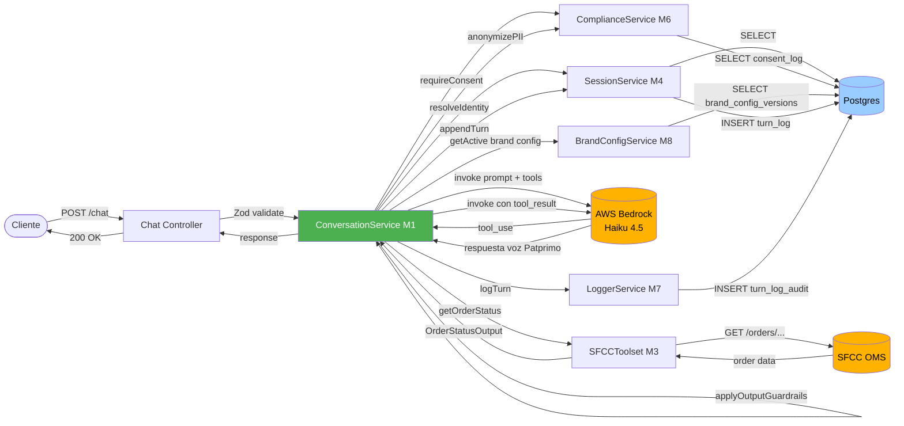
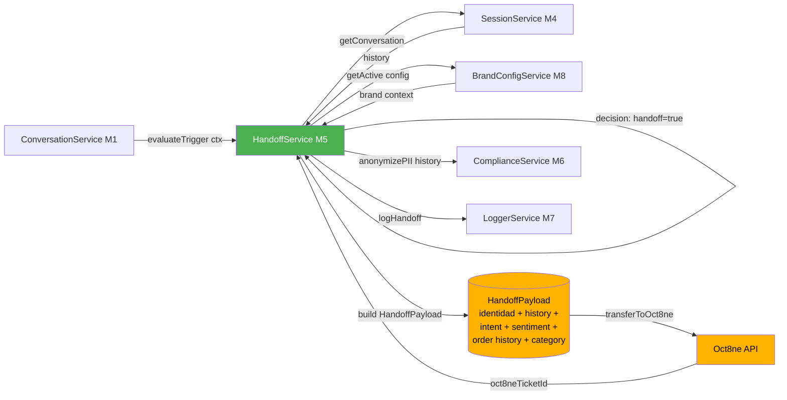

# Component Dependencies — Hermes

> **Scope**: Matriz de dependencias entre los 8 módulos M1–M8 + cross-cutting CC-1..4, patrones de comunicación, y data flow diagrams.

---

## 1. Dependency Matrix

Una fila depende de las columnas marcadas con ✅. "Dependencia" = invoca métodos públicos directamente o consume eventos/contratos del otro componente.

| ↓ depende de → | M1 Conv | M2 Know | M3 SFCC | M4 Sess | M5 Hand | M6 Comp | M7 Obs | M8 Brand | CC App | DB |
|---|---|---|---|---|---|---|---|---|---|---|
| **M1 Conversation** | — | ✅ (Fase 2) | ✅ | ✅ | ✅ | ✅ | ✅ | ✅ | — | — |
| **M2 Knowledge** | — | — | — | — | — | — | ✅ | ✅ | — | ✅ |
| **M3 SFCC Integrations** | — | — | — | — | — | — | ✅ | — | — | — |
| **M4 Identity & Session** | — | — | — | — | — | — | ✅ | — | — | ✅ |
| **M5 Handoff** | — | — | ✅ (orderHistory) | ✅ | — | ✅ (PII anon en log) | ✅ | ✅ (brand context) | — | ✅ |
| **M6 Compliance** | — | — | — | — | — | — | ✅ | — | — | ✅ |
| **M7 Observability** | — | — | — | — | — | — | — | — | — | ✅ |
| **M8 Brand Config + A/B** | — | — | — | — | — | — | ✅ | — | — | ✅ |
| **CC-1 App (composition root)** | ✅ | ✅ | ✅ | ✅ | ✅ | ✅ | ✅ | ✅ | — | ✅ |
| **CC-2 Global Error Handler** | — | — | — | — | — | — | ✅ | — | — | — |
| **CC-3 Request Context** | — | — | — | — | — | — | ✅ | — | — | — |

**Observaciones:**
1. **M1 es el hub** — depende de casi todos los demás. Esperable: es el orquestador del turno.
2. **M7 Observability NO depende de nadie** — todos los demás lo invocan, pero él solo escribe a DB. Es un sumidero, no un orquestador.
3. **M6 Compliance** está aislado — solo depende de DB y M7. Esto satisface SECURITY-11 (separation of security-critical logic).
4. **M2 Knowledge** es práticamente standalone en MVP — solo M1 lo consume (Fase 2). En MUST HAVE, no se usa.
5. **No hay dependencias circulares** — verificado visualmente. M1 → M5 → M3 forma una cadena, no un ciclo.

---

## 2. Communication Patterns

### 2.1 Sync, in-process method calls (default)
Casi toda la comunicación entre módulos es **invocación directa de métodos async** sobre las instancias singleton inyectadas vía `fastify.decorate`. No queue, no event bus, no IPC.

**Justificación**: monolithic Fastify app (Q1=A), proceso único, MVP scope, latencia objetivo agresiva (<30s p50). Agregar broker (Kafka, SQS) sería sobre-engineering.

### 2.2 Persistent state via Postgres
Cualquier estado que cruza requests vive en Postgres. Ejemplos:
- `conversation_state` (M4)
- `consent_log` (M6)
- `turn_log` (M7)
- `handoff_log` (M5)
- `brand_config_versions` (M8)
- `ab_split_config` (M8)

### 2.3 External HTTP (sync)
Tres outbound integrations:
- **SFCC OCAPI/SCAPI** (M3) — REST/JSON
- **AWS Bedrock LATAM** (M1 vía SDK) — invocación SDK que internamente hace HTTPS
- **Oct8ne API** (M5) — REST/JSON (a confirmar en Functional Design Unit 3)

Todas con: retry exponential backoff (3 attempts), circuit breaker, timeout explícito (10s default por call).

### 2.4 Background jobs (intra-process)
Implementación MVP: `node-cron` o `setInterval` dentro del mismo proceso Fastify.
- Session cleanup (M4) — cada 30 min
- Retention enforcement (M6) — daily
- AB rollback evaluator (M8) — cada 5 min
- Alert rule evaluator (M7) — cada 1 min

**Riesgo conocido**: si el proceso crashea, los jobs no se ejecutan. **Aceptable en MVP** porque Docker Compose puede restart-on-failure. Fase 2 → migrar a scheduler externo.

---

## 3. Data Flow Diagrams

### 3.1 Turno completo (MUST HAVE Caso 1)



### 3.2 Handoff con paquete de contexto



### 3.3 A/B routing al inicio de la sesión

```mermaid
flowchart TB
    Widget([Widget SFCC]) -->|GET /ab/decide?brand=patprimo&sessionId=X| ABCtrl[AB Controller]
    ABCtrl -->|decideBot| ABSvc[ABRoutingService M8]
    ABSvc -->|getCurrentSplit| PG[(Postgres<br/>ab_split_config)]
    PG -->|hermesPercent: 10| ABSvc
    ABSvc -->|hash sessionId mod 100| ABSvc
    ABSvc -->|return 'hermes' o 'oct8ne'| ABCtrl
    ABCtrl -->|200 OK { target: 'hermes'/'oct8ne' }| Widget

    Cron[AlertingService cron 5min] -.->|evaluate rules| ABSvc
    ABSvc -.->|si KPI < threshold| Rollback[setSplit hermesPercent=0]
    Rollback -.->|UPDATE| PG

    style ABSvc fill:#4CAF50,color:#fff
```

---

## 4. Critical paths para Code Generation

Cuando lleguemos a Code Generation por unit, estos son los flujos que **no pueden romperse**:

| Path | Pasos | Stories | Riesgo si falla |
|---|---|---|---|
| **P-1 Happy Caso 1** | Cliente → /chat → consent → tool call SFCC → respuesta | E1-S1..S6 | MVP no demo-able |
| **P-2 Handoff** | Trigger detectado → context package → Oct8ne | E3-S1..S4 | Anti-pattern ASOS, riesgo regulatorio |
| **P-3 A/B + rollback** | decideBot → routing decision → rollback automático | E4-S2 | No se valida promesa de conversión |
| **P-4 Logging audit** | Cada turno → log estructurado → append-only persistido | E1-S6 | No defensa ante SIC |

Functional Design por unit debe priorizar estos en orden P-1 > P-4 > P-2 > P-3.

---

## 5. Security Compliance Summary

| Rule | Status | Notas |
|---|---|---|
| SECURITY-08 | Aplicado | Diagramas hacen explícito que `/chat` es público pero requiere consent gate; `/ab/decide` es público stateless; endpoints admin requieren auth middleware (definido en Functional Design Unit 2) |
| SECURITY-11 | Aplicado | Diagrama de dependencia muestra M6 aislado; secrets (Bedrock credentials, SFCC tokens) no aparecen en flow — se cargan vía env vars y secret manager |
| Otros | N/A en este stage | Code-level — se evalúan en stages siguientes |

*No hay findings bloqueantes en este stage.*
