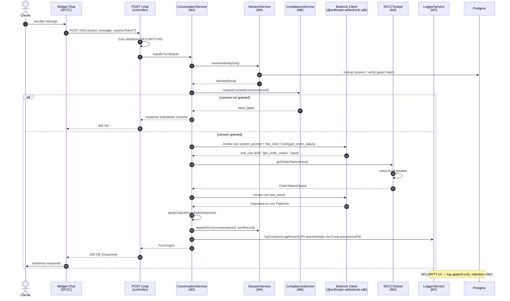

# Services & Orchestration — Hermes

> **Scope**: Patrones de orquestación, service boundaries y cómo las capas se coordinan. El detalle algorítmico va a Functional Design.
> **Stack base**: Fastify monolithic con plugins + `fastify.decorate` para DI + layered folders.

---

## 1. Service layer overview

| Service | Lives in | Implements | Decorated as |
|---|---|---|---|
| `ConversationService` | `services/conversation.service.ts` | `IConversationService` | `fastify.conversation` |
| `KnowledgeService` | `services/knowledge.service.ts` (stub MVP) | `IKnowledgeService` | `fastify.knowledge` |
| `SFCCToolset` | `services/sfcc-toolset.service.ts` | `ISFCCToolset` | `fastify.sfccTools` |
| `SessionService` | `services/session.service.ts` | `ISessionService` | `fastify.session` |
| `HandoffService` | `services/handoff.service.ts` | `IHandoffService` | `fastify.handoff` |
| `ComplianceService` | `services/compliance.service.ts` | `IComplianceService` | `fastify.compliance` |
| `LoggerService` | `services/logger.service.ts` | `ILoggerService` | `fastify.appLogger` |
| `DashboardService` | `services/dashboard.service.ts` | `IDashboardService` | `fastify.dashboard` |
| `AlertingService` | `services/alerting.service.ts` | `IAlertingService` | `fastify.alerting` |
| `BrandConfigService` | `services/brand-config.service.ts` | `IBrandConfigService` | `fastify.brandConfig` |
| `ABRoutingService` | `services/ab-routing.service.ts` | `IABRoutingService` | `fastify.abRouting` |

**Convención**: cada servicio se instancia una vez por proceso (singleton dentro del Fastify instance). Las dependencies se inyectan vía constructor en `app.ts` cuando se construye el Fastify instance.

---

## 2. Orquestación del turno (Caso 1 — happy path)

Esta es la orquestación más crítica del MVP. Soporta los stories E1-S1 a E1-S6.



---

## 3. Orquestación del handoff (Caso 5 — escalamiento)

Esta orquestación cubre E3-S1 (detección) → E3-S2 (paquete) → E3-S3 (transferencia).

```mermaid
sequenceDiagram
    autonumber
    actor Cliente
    participant Conv as ConversationService<br/>(M1)
    participant Hand as HandoffService<br/>(M5)
    participant Sess as SessionService<br/>(M4)
    participant Comp as ComplianceService<br/>(M6)
    participant Oct8 as Oct8ne Widget API
    participant Logger as LoggerService

    Cliente->>Conv: mensaje (sentimiento neg / out-of-scope / explicit request)
    Conv->>Hand: evaluateTrigger(ctx)
    Hand-->>Conv: HandoffDecision { handoff: true, reason }

    alt handoff = true
        Conv->>Hand: buildContextPackage(conversationId)
        Hand->>Sess: getConversation(conversationId)
        Sess-->>Hand: ConversationState con histórico
        Hand->>Comp: anonymizePII(history) [solo para LOG; el paquete al agente lleva PII visible]
        Hand-->>Hand: HandoffPayload

        Hand->>Oct8: transferToOct8ne(payload)
        Oct8-->>Hand: HandoffResult { oct8neTicketId, transferredAt }

        Hand->>Logger: logHandoff(record) [PII anonimizada]
        Hand-->>Conv: HandoffResult
        Conv->>Cliente: "te paso con una persona"
    end
```

---

## 4. Orquestación del A/B routing (entrada al chat)

A nivel de widget, antes de que el cliente llegue al endpoint `/chat` de Hermes, hay una decisión de routing entre Hermes y Oct8ne. Para el MVP, el routing se hace en el **edge** (widget de SFCC consulta un endpoint pequeño `/ab/decide`).

```mermaid
flowchart LR
    Cliente[Cliente abre widget] --> Edge["/ab/decide?brand=patprimo&sessionId=..."]
    Edge --> Hash{hash(sessionId) mod 100}
    Hash -->|< hermesPercent| Hermes[Routea a Hermes /chat]
    Hash -->|>= hermesPercent| Oct8[Routea a Oct8ne widget]

    AutoRollback[AlertingService<br/>evalúa cada N min] -.->|si KPI cae| FlipSplit[ABRoutingService.setSplit<br/>hermesPercent = 0]
    FlipSplit -.-> Edge
```

**Decisión técnica**: `decideBot()` es **stateless por request**, deterministic por `sessionId`. La regla `autoRollback` corre como **scheduled job** dentro de `AlertingService`.

---

## 5. Communication patterns

### 5.1 Intra-process (todos los módulos viven en el mismo proceso Node)
- **Inter-service**: invocación directa de método. Sin queue, sin event bus.
- **Estado compartido**: a través de Postgres y de `fastify.decorate` para singletons de configuración (ej. `fastify.bedrockClient`).
- **Concurrencia**: Node async I/O. Pool de conexiones pg = 10 default (ajustable). No usar transacciones long-lived.

### 5.2 External
- **A SFCC**: HTTP REST sobre OCAPI/SCAPI. `axios` o `undici` (decisión en Code Generation).
- **A Bedrock**: SDK `@anthropic-ai/bedrock-sdk` (request/response; streaming en Fase 2 si latencia lo exige).
- **A Oct8ne**: HTTP REST sobre su API pública o webhook bridge (a confirmar con vendor en Functional Design Unit 3).
- **A frontend (widget)**: HTTP JSON sobre `/chat`, `/ab/decide`, `/health`, etc. CORS restricted a origins explícitos de SFCC (SECURITY-08).

### 5.3 Background jobs (MVP scope)
| Job | Frecuencia | Servicio | Notas |
|---|---|---|---|
| Session cleanup | 30 min | SessionService.closeStale | TTL-based |
| Retention enforcement | Daily | ComplianceService.enforceRetention | purga registros vencidos |
| AB rollback evaluator | 5 min | ABRoutingService.autoRollback | corre rules; flip split si trigger |
| Alert rule evaluator | 1 min | AlertingService.evaluateRules | dispara notificaciones |

**Runner**: para MVP, jobs corren dentro del mismo proceso usando `node-cron` o `setInterval` con jitter. En Fase 2 → mover a worker dedicado o scheduler AWS.

---

## 6. Boundaries & responsibilities resumen

| Boundary | Responsabilidad clara | NO debe hacer |
|---|---|---|
| **Controllers** (`controllers/`) | Validación Zod, routing HTTP, mapping request→service input, mapping service output→HTTP response | Business logic, queries SQL directas |
| **Services** (`services/`) | Business logic, orquestación entre servicios, llamadas a repos | Manejar HTTP (no leer headers, no setear cookies), conocer Fastify internals |
| **Repositories** (`repositories/`) | Acceso a Postgres vía `pg` driver, queries SQL parametrizadas | Business logic, validación, llamadas a otros servicios |
| **Models** (`models/`) | Zod schemas + TS types derivados | Lógica, side-effects |
| **Tools** (`tools/`) | Wrappers sobre APIs externas (SFCC, Bedrock); retry/circuit-breaker | Conocer la conversación o el modelo de datos interno (los tools son consumidos por el orquestador) |
| **Plugins** (`plugins/`) | Registrar rutas, decorations, hooks; conectar capas a Fastify | Implementar business logic |

---

## 7. Security Compliance Summary

| Rule | Status | Notas |
|---|---|---|
| SECURITY-05 | Aplicado | Validación Zod en boundary de controllers; cada service method recibe DTOs ya validados |
| SECURITY-08 | Aplicado | CORS restricted en plugin de chat; cada endpoint admin requiere middleware de auth (definido en Functional Design Unit 2) |
| SECURITY-11 | Aplicado | Service boundaries enforcement; M6 Compliance es el ÚNICO módulo que toca PII raw; rate limiting en `/chat` (plugin level) |
| SECURITY-15 | Aplicado | Errores se propagan; CC-2 Global Error Handler centraliza el fail-closed; `try/finally` para releases de DB connection en repositories |
| SECURITY-01, 02, 03, 04, 06, 07, 09, 10, 12, 13, 14 | N/A en este stage | Infra/deploy/code-level — evaluados en NFR Design, Infrastructure Design, Code Generation |

*No hay findings bloqueantes en este stage.*
