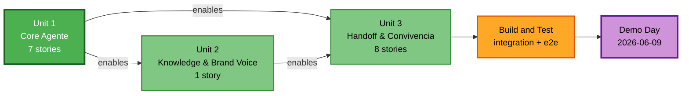

# Unit Dependencies — Hermes

> **Scope**: Dependencias entre las 3 unidades de trabajo, orden de ejecución, integration points y riesgos de violar el orden.

---

## 1. Dependency Matrix

| ↓ depende de → | Unit 1 (Core) | Unit 2 (Knowledge & Brand Voice) | Unit 3 (Handoff & Convivencia) |
|---|---|---|---|
| **Unit 1 (Core Agente)** | — | ❌ | ❌ |
| **Unit 2 (Knowledge & Brand Voice)** | ✅ (depende de M1, models/, lib/, migrations base) | — | ❌ |
| **Unit 3 (Handoff & Convivencia)** | ✅ (depende de M1, M3, M4, M7, models/, lib/) | ✅ parcial (orderHistory para handoff package; brand context para A/B routing) | — |

**Observación clave**: Unit 1 es **independiente** y entregable como demo. Units 2 y 3 dependen estrictamente de Unit 1.

---

## 2. Execution Order (mandatory sequential)

**Justificación del orden:**

1. **Unit 1 primero (semanas 1–2 estimadas)** — sin M1 (orquestador) ni M3 (tools) ni M4 (sesión) ni M6 (compliance) ni M7 (logger), nada del resto funciona. Unit 1 establece el "esqueleto" del repo + Postgres + Bedrock client.
2. **Unit 2 segundo (semana 3 — primera parte)** — antes de Unit 3 porque el handoff package (Unit 3) necesita `brand` context. Unit 2 reemplaza el seed bootstrap de Unit 1 por config en DB.
3. **Unit 3 tercero (semana 3 – primera parte de semana 4)** — handoff requiere tanto el orquestador (Unit 1) como el brand config funcional (Unit 2). A/B routing también necesita brand config para determinar a qué bot enrutar por marca.
4. **Build and Test al final (semana 4 — parte final)** — integración end-to-end de las 3 unidades, eval suite del agente, red team de guardrails, performance tests, e2e de los journeys MUST HAVE.

---

## 3. Integration Points

Donde las unidades "se tocan" — puntos críticos a validar en Build and Test.

### IP-1: Unit 2 reemplaza brand_config seed de Unit 1
- **Where**: `M1 ConversationService` lee la config Patprimo. Unit 1 la lee de un seed hard-coded; Unit 2 introduce `BrandConfigService.getActive(brand)`.
- **Cambio en interfaz**: ConversationService deja de leer constante; pasa a inyectar `brandConfig` service.
- **Risk si falla**: deploy de Unit 2 no entrega brand config válido → bot responde con voz genérica o crashea. **Mitigación**: feature flag `USE_DB_BRAND_CONFIG` durante migración; rollback al seed si falla.

### IP-2: Unit 3 consume `M3 SFCCToolset.getOrderHistory()` (nuevo método)
- **Where**: HandoffService (Unit 3) construye paquete de contexto incluyendo `orderHistory[]`. Unit 1 implementa `getOrderStatus`; Unit 3 agrega `getOrderHistory`.
- **Cambio en interfaz**: extiende `ISFCCToolset` con un método nuevo. No rompe contratos existentes.
- **Risk si falla**: handoff package sin histórico → agente humano debe consultar manual. **Mitigación**: handoff package degrada gracefully (orderHistory queda vacío + warning en log).

### IP-3: Unit 3 consume `M6 ComplianceService.anonymizePII()` con nuevo input
- **Where**: HandoffService llama a anonymizePII con conversación entera (Unit 1 ya implementó anonymize de texto suelto).
- **Cambio**: extiende `anonymizePII` para acceptar arrays de TurnRecord. No rompe contrato actual (string sigue funcionando).
- **Risk si falla**: PII cleartext en handoff_log → violación SECURITY-03. **Mitigación**: tests obligatorios validan que cada turno del log post-handoff no contenga patrones PII.

### IP-4: Unit 3 lee logs escritos por Unit 1
- **Where**: DashboardService (Unit 3 read-path) hace queries sobre `turn_log_audit` (Unit 1 write-path).
- **Cambio en interfaz**: ninguno — Unit 3 solo SELECT. El schema de Unit 1 debe estar versionado (migrations 0001) ANTES de Unit 3.
- **Risk si falla**: ninguno significativo — solo dashboards quedan vacíos si Unit 1 no ha escrito aún.

### IP-5: Unit 3 publica eventos al widget SFCC (handoff transferred + A/B route decision)
- **Where**: El widget SFCC del cliente final consume el endpoint público `/ab/decide` (decide bot al cargar) y respuestas de `/chat` (incluye `handoffTriggered` flag para que el widget cambie UI).
- **Cambio**: agregar field `handoffTriggered: boolean` al response de `/chat`. Coordinar con el frontend (decisión OD-5 pendiente — Functional Design Unit 1 propondrá).
- **Risk si falla**: cliente no sabe que se transfirió → confusión + posible repetición de mensaje. **Mitigación**: UI fallback que muestre "te paso con persona" en el último mensaje del bot.

---

## 4. Riesgos de violar el orden

| Si se intenta... | ...este riesgo materializa |
|---|---|
| Iniciar Unit 2 sin terminar Unit 1 | Brand Config service no puede ser consumido por M1 porque M1 no existe; trabajo se va a stubs que después hay que reescribir |
| Iniciar Unit 3 sin terminar Unit 1 | Handoff trigger no tiene de dónde detectarse (M1 ausente); dashboards sin datos; A/B routing apunta a Hermes-vacío |
| Iniciar Unit 3 sin terminar Unit 2 | Handoff package no tiene brand context; A/B routing no puede leer config por marca |
| Saltar Unit 2 entera (ir Unit 1 → Unit 3) | Voz Patprimo queda permanentemente en el seed bootstrap; no hay sign-off auditable para Brand Manager (incumple riesgo PRD §12 R5) |

**Regla**: si por cualquier razón Unit 1 se extiende y comprime los plazos, **degradar Unit 2 antes que Unit 3**. Sin Unit 3 no hay convivencia con Oct8ne (no se puede deploy A/B); sin Unit 2 solo se pierde el sign-off auditable (parchearable con commit manual del prompt).

---

## 5. Parallelization opportunities

**Dentro de cada unidad** (mismo desarrollador):
- En Unit 1: M1 ↔ M3 ↔ M4 son secuenciales (M1 depende de M4 para identity, M3 para tools); M6 y M7 son razonablemente paralelos a M1.
- En Unit 3: M5 handoff y M8 A/B routing pueden trabajarse en paralelo dentro de la unit; dashboards pueden seguir.

**Cross-unit**:
- No recomendado en MVP con 1 dev. Si se incorpora un segundo desarrollador, Unit 2 (1 story gruesa de brand config CRUD) podría empezar en paralelo con la fase final de Unit 1, **pero** integration point IP-1 debe coordinarse cuidadosamente.

---

## 6. Coordination requirements

- **Schema migrations**: Unit 1 ejecuta `0001_unit1_base.sql`. Unit 2 ejecuta `0002_unit2_brand_config.sql` después de Unit 1 desplegada. Unit 3 ejecuta `0003_unit3_handoff_ab.sql` después de Unit 2.
- **API contracts**: para cada cambio de interface entre units (ej. IP-1 reemplazo brand_config seed), Unit 1 expone una versión que soporta ambos modos (seed + DB) durante una ventana de transición; Unit 2 valida el switch antes de eliminar el seed.
- **`models/` ownership (Q3=C)**: Units 2 y 3 proponen nuevos tipos en `models/` via PR review. El PR de Unit 2/3 debe incluir un test que demuestre que los tipos viejos no se rompen.
- **`lib/` ownership (Q2=A)**: Units 2 y 3 solo consumen utilities existentes. Si necesitan una nueva utility, crean un issue antes y Unit 1 (o el dev rotando) la agrega.

---

## 7. Rollback strategy per unit

Cada unit tiene rollback granular en caso de bug post-deploy:

| Unit | Rollback path |
|---|---|
| Unit 1 | Imposible rollback completo (es la base). Hot-fix forward via PR + redeploy. Docker Compose mantiene última imagen estable. |
| Unit 2 | Revertir feature flag `USE_DB_BRAND_CONFIG` a false → M1 cae de vuelta al seed bootstrap. CRUD admin queda visible pero no afecta runtime. |
| Unit 3 | A/B `setSplit(hermesPercent=0)` deja todo el tráfico en Oct8ne. Handoff queda inactivo automáticamente porque ningún cliente entra a Hermes. |

---

## 8. Security Compliance Summary

| Rule | Status | Notas |
|---|---|---|
| SECURITY-11 | Aplicado | Boundaries entre units no introducen coupling crítico — M6 sigue siendo único módulo con PII raw; M5 (Unit 3) usa M6 como dependencia, no implementa PII handling por su cuenta |
| Otros SECURITY rules | N/A en este stage | Evaluados en NFR Design + Code Generation per unit |

*No hay findings bloqueantes en este stage.*
