# Execution Plan — Hermes

**Project**: Hermes — Agente Conversacional de IA para grupo PASH SAS
**Stage**: Inception / Workflow Planning
**Date**: 2026-05-20
**Input artifacts**: `requirements.md`, `stories.md`, `personas.md`, `prd.md`

---

## 1. Detailed Analysis Summary

### 1.1 Transformation Scope

**Greenfield** — no hay sistema previo a transformar. Hermes se construye desde cero, con un único punto de **convivencia operacional** con un sistema legado: Oct8ne en Patprimo, vía A/B con rollback automático (story E4-S2). No es transformación arquitectónica de un sistema existente; es **lanzamiento de un nuevo sistema en convivencia controlada**.

### 1.2 Change Impact Assessment

| Área | Impacto | Detalle |
|---|---|---|
| **User-facing changes** | ✅ Sí — Alto | Nueva experiencia de chat para shopper Patprimo Col; widget en SFCC con personalidad Patprimo en lugar de árbol de decisión Oct8ne (para el % asignado en A/B) |
| **Structural changes** | N/A | Greenfield — no hay estructura previa que modificar |
| **Data model changes** | ✅ Sí — Alto | Nuevas tablas Postgres (sessions, turns, conversations, consent_log, brand_configs, ab_assignments) + pgvector para RAG futuro |
| **API changes** | ✅ Sí — Alto | Nuevos endpoints: chat (público), admin (operator/brand manager/compliance), eval suite (interno), tools internos (`get_order_status`, etc.) |
| **NFR impact** | ✅ Sí — Alto | Perf (<30s p50), Security (SECURITY-01..15 blocking), Compliance (Ley 1581 + SIC 002/2024), Observability (logs append-only 90+ días) |

### 1.3 Risk Assessment

| Dimensión | Valor | Justificación |
|---|---|---|
| **Risk Level** | **HIGH** | (a) Producto-grado, no PoC; (b) tráfico real Patprimo (~150k visitas/mes); (c) revenue 50–60% por chat — Oct8ne no puede degradarse; (d) compliance regulado (Ley 1581 + SIC); (e) LLM outputs no-determinísticos |
| **Rollback Complexity** | **Moderada-Baja** | MVP local-only Docker Compose; A/B con rollback automático en <5 min (E4-S2); Oct8ne sigue operativo en paralelo |
| **Testing Complexity** | **Compleja** | LLM eval suite (PRD §11) + red team guardrails (E1-S5) + integración SFCC tool calls + e2e journeys + PBT en lógica de negocio |
| **Timeline Pressure** | **Alta** | Demo Day 2026-06-09 — 20 días desde hoy. Scope limitado a MUST HAVE mitiga, pero deja muy poco margen para imprevistos. |

---

## 2. Workflow Visualization

### 2.1 Mermaid Flowchart

```mermaid
flowchart TD
    Start(["User Request: Construir Hermes"])

    subgraph INCEPTION["🔵 INCEPTION PHASE"]
        WD["Workspace Detection<br/><b>COMPLETED</b>"]
        RA["Requirements Analysis<br/><b>COMPLETED</b>"]
        US["User Stories<br/><b>COMPLETED</b>"]
        WP["Workflow Planning<br/><b>IN PROGRESS</b>"]
        AD["Application Design<br/><b>EXECUTE</b>"]
        UG["Units Generation<br/><b>EXECUTE</b>"]
    end

    subgraph CONSTRUCTION["🟢 CONSTRUCTION PHASE"]
        U1["Unit 1 — Core Agente<br/>FD → NFR-R → NFR-D → ID → CG"]
        U2["Unit 2 — Knowledge & Brand Voice<br/>FD → NFR-R → NFR-D → ID → CG"]
        U3["Unit 3 — Handoff & Convivencia<br/>FD → NFR-R → NFR-D → ID → CG"]
        BT["Build and Test<br/><b>EXECUTE</b>"]
    end

    subgraph OPERATIONS["🟡 OPERATIONS PHASE"]
        OPS["Operations<br/><b>PLACEHOLDER</b>"]
    end

    Start --> WD
    WD --> RA
    RA --> US
    US --> WP
    WP --> AD
    AD --> UG
    UG --> U1
    U1 --> U2
    U2 --> U3
    U3 --> BT
    BT --> OPS
    OPS --> Endd(["Complete: Hermes MVP listo"])

    style WD fill:#4CAF50,stroke:#1B5E20,stroke-width:3px,color:#fff
    style RA fill:#4CAF50,stroke:#1B5E20,stroke-width:3px,color:#fff
    style US fill:#4CAF50,stroke:#1B5E20,stroke-width:3px,color:#fff
    style WP fill:#FFA726,stroke:#E65100,stroke-width:3px,color:#000
    style AD fill:#FFA726,stroke:#E65100,stroke-width:3px,stroke-dasharray: 5 5,color:#000
    style UG fill:#FFA726,stroke:#E65100,stroke-width:3px,stroke-dasharray: 5 5,color:#000
    style U1 fill:#4CAF50,stroke:#1B5E20,stroke-width:3px,color:#fff
    style U2 fill:#4CAF50,stroke:#1B5E20,stroke-width:3px,color:#fff
    style U3 fill:#4CAF50,stroke:#1B5E20,stroke-width:3px,color:#fff
    style BT fill:#4CAF50,stroke:#1B5E20,stroke-width:3px,color:#fff
    style OPS fill:#BDBDBD,stroke:#424242,stroke-width:2px,color:#000
    style Start fill:#CE93D8,stroke:#6A1B9A,stroke-width:3px,color:#000
    style Endd fill:#CE93D8,stroke:#6A1B9A,stroke-width:3px,color:#000

    linkStyle default stroke:#333,stroke-width:2px
```



### 2.2 Text Alternative (fallback)

```
🔵 INCEPTION PHASE
  ✅ Workspace Detection           (COMPLETED)
  ⊘  Reverse Engineering           (SKIPPED — greenfield)
  ✅ Requirements Analysis         (COMPLETED — Comprehensive depth)
  ✅ User Stories                  (COMPLETED — 7 personas + 16 stories)
  ⏳ Workflow Planning             (IN PROGRESS — this document)
  ▶  Application Design            (EXECUTE — 8 módulos M1–M8 a diseñar)
  ▶  Units Generation              (EXECUTE — ratificar 3 units pre-definidas)

🟢 CONSTRUCTION PHASE (Per-Unit Loop × 3)
  Unit 1 — Core Agente             (M1+M3+M4+M6+M7 → entrega Caso 1)
    ▶ Functional Design
    ▶ NFR Requirements
    ▶ NFR Design
    ▶ Infrastructure Design
    ▶ Code Generation (planning + generation)
  Unit 2 — Knowledge & Brand Voice (M2+M8 partial)
    ▶ (mismas 5 stages)
  Unit 3 — Handoff & Convivencia   (M5+M8+A/B Oct8ne)
    ▶ (mismas 5 stages)
  ▶ Build and Test                 (EXECUTE — al cierre de las 3 units)

🟡 OPERATIONS PHASE
  ◆ Operations                     (PLACEHOLDER — fuera de scope MVP)
```

---

## 3. Phases to Execute

### 🔵 INCEPTION PHASE

- [x] **Workspace Detection** — COMPLETED
  - *Rationale*: Always executes. Determinó greenfield, workspace root `ai-dlc/`, código de Hermes irá a `hermes/`.
- [x] **Reverse Engineering** — SKIPPED (N/A)
  - *Rationale*: Greenfield — no hay codebase previo que analizar.
- [x] **Requirements Analysis** — COMPLETED
  - *Rationale*: Comprehensive depth aplicado por complejidad alta + alcance system-wide + extensions opt-in (Security + PBT).
- [x] **User Stories** — COMPLETED
  - *Rationale*: 6/6 indicadores High Priority aplican. 16 stories en 4 Epics, coverage 10/10 MH features.
- [x] **Workflow Planning** — IN PROGRESS (este documento)
  - *Rationale*: Always executes.
- [ ] **Application Design** — EXECUTE
  - *Rationale*: 8 módulos M1–M8 nuevos por diseñar; cada uno con features, roles, screens y principios. Sin Application Design, la decomposición en units carecería de contrato de interfaces. **Depth: Standard.**
- [ ] **Units Generation** — EXECUTE
  - *Rationale*: 3 units ya pre-definidas en `requirements.md` §8 (Q8=C). Units Generation ratifica/refina con base en Application Design y deja registrado el contrato de cada unit antes de Construction. **Depth: Minimal** (las decisiones gruesas ya están tomadas).

### 🟢 CONSTRUCTION PHASE (Per-Unit Loop × 3 units)

Para **cada una de las 3 units** (Unit 1 → Unit 2 → Unit 3, secuencial por dependencias):

- [ ] **Functional Design** — EXECUTE
  - *Rationale*: Nuevos data models (Postgres schemas), lógica de negocio compleja (orquestador LLM, tool dispatching, sentimiento heurístico, A/B routing). Sin FD per unit, code generation va a ciegas.
- [ ] **NFR Requirements** — EXECUTE
  - *Rationale*: Perf (<30s p50), Security (15 reglas activas), Scalability (50 conv concurrentes target), Observability (logs append-only). Cada unit tiene NFRs distintos (ej. Unit 1 lleva grueso de perf; Unit 3 lleva grueso de rollback/observabilidad).
- [ ] **NFR Design** — EXECUTE
  - *Rationale*: NFR Requirements ran → NFR Design es necesario para traducir requirements en patrones concretos (rate limiting, retry, circuit breaker, encryption, etc.).
- [ ] **Infrastructure Design** — EXECUTE
  - *Rationale*: MVP local-only Docker Compose; estructura debe ser portable a AWS Fase 2 (Bedrock LATAM ya fijado, app hosting TBD). Sin ID, el `docker-compose.yml` se diseña ad-hoc.
- [ ] **Code Generation** — EXECUTE (ALWAYS)
  - *Rationale*: Mandatorio.

Después de las 3 units:

- [ ] **Build and Test** — EXECUTE (ALWAYS)
  - *Rationale*: Mandatorio. Incluye eval suite del agente (PRD §11), tests de integración entre units, red team de guardrails, performance test contra target <30s p50.

### 🟡 OPERATIONS PHASE

- [ ] **Operations** — PLACEHOLDER
  - *Rationale*: Stage definido como placeholder en AI-DLC actual. Para Hermes, las decisiones operacionales del MVP (alertas, dashboards, runbooks) se cubren dentro de NFR Design + Infrastructure Design + Build and Test. Deployment a AWS y monitoring formal entran en Fase 2 post-Demo Day.

---

## 4. Stages Skipped — Resumen

| Stage | Phase | Status | Rationale |
|---|---|---|---|
| Reverse Engineering | Inception | SKIPPED | Greenfield (no hay código previo) |
| Operations (formal) | Operations | PLACEHOLDER | Fuera de scope MVP — cubierto operacionalmente por NFR + Infrastructure + Build/Test |

**Total stages a ejecutar después de este punto**: 2 (Inception) + 5 × 3 units (Construction Per-Unit Loop) + 1 (Build and Test) = **18 stage-executions** restantes.

---

## 5. Unit Sequence (Per-Unit Loop)

Las units se ejecutan **secuencialmente** porque hay dependencias funcionales:

| # | Unit | Depende de | Bloquea a | Justificación de orden |
|---|---|---|---|---|
| 1 | **Core Agente** (M1+M3+M4+M6+M7) | — | Unit 2, Unit 3 | Define M1 (orquestador) — la base sobre la que todo lo demás se enchufa. Entrega Caso 1 end-to-end (MH-1). |
| 2 | **Knowledge & Brand Voice** (M2+M8 partial) | Unit 1 (M1 carga brand config) | Unit 3 (handoff package usa brand context) | Carga config Patprimo (MH-3). No incluye RAG denso (no requerido para MUST HAVE — solo Caso 1 que no usa M2). |
| 3 | **Handoff & Convivencia** (M5+M8+A/B Oct8ne) | Unit 1 (handoff trigger desde orquestador), Unit 2 (paquete de contexto incluye brand) | Build and Test | Última porque su valor (handoff + A/B) requiere que las otras unidades estén operativas. |

**No hay paralelización**: el equipo del MVP es pequeño (per PRD: 1 dev en 4 semanas como caso base). Secuencial reduce coordinación.

---

## 6. Estimated Timeline

| Hito | Fecha | Días restantes (hoy 2026-05-20) |
|---|---|---|
| **Hoy — Approval de execution plan** | 2026-05-20 | 0 |
| Application Design + Units Generation completos | 2026-05-22 | 2 |
| Unit 1 — Core Agente completo (FD→CG) | 2026-05-29 | 9 |
| Unit 2 — Knowledge & Brand Voice completo | 2026-06-02 | 13 |
| Unit 3 — Handoff & Convivencia completo | 2026-06-06 | 17 |
| Build and Test completo | 2026-06-08 | 19 |
| **Demo Day** | **2026-06-09** | **20** |

⚠️ **Buffer crítico**: 1 día entre Build/Test y Demo Day. Cualquier retraso en cascada compromete Demo Day. Mitigación: si Unit 1 toma >9 días, se considera mover Unit 2 a "Knowledge mínimo" (solo brand config, sin RAG ingestión).

---

## 7. Success Criteria

### 7.1 Primary Goal
Demo funcional el 2026-06-09 del **Caso 1 (estado de pedido)** end-to-end con shopper Patprimo Col, mostrando: saludo+consent, identificación dual, tool call SFCC en runtime, respuesta en voz Patprimo, handoff a humano disponible, logging auditable, A/B con Oct8ne activo.

### 7.2 Key Deliverables
- Código TypeScript funcional en `hermes/` corriendo via Docker Compose
- 16 stories (E1-E4) implementadas según AC Gherkin
- Postgres con schema diseñado + datos seed para demo
- Eval suite (PRD §11) corriendo con ≥30 casos verde
- Red team de guardrails con ≥95% rechazo correcto
- Dashboard del operador funcional (incluso si rudimentario)
- Documentación AI-DLC completa en `ai-dlc/aidlc-docs/`

### 7.3 Quality Gates
- ✅ Application Design aprobado por usuario
- ✅ Units Generation aprobado por usuario
- ✅ Para cada Unit: FD + NFR-R + NFR-D + ID + CG aprobados sequencialmente
- ✅ Build and Test verde antes de Demo Day
- ✅ Security Compliance: las 15 reglas SECURITY evaluadas como compliant (o N/A justificado) al final de Code Generation
- ✅ PBT applied en módulos críticos (orquestador, validadores, anonymizer)

### 7.4 Out-of-scope para esta iteración (recordatorio)
- Should Have (Caso 2 disponibilidad, dashboard drill-down, alertas avanzadas, persistencia de sesión, sentimiento entrenado)
- Could Have (Casos 3, 4, modelo dos-tier, multi-marca, WhatsApp)
- Won't Have (todas las marcas distintas a Patprimo, países distintos a Col, multilenguaje, fine-tuning, etc.)
- Deployment a AWS production (Fase 2)
- Migración a Salesforce Agentforce (Fase 2/3)

---

## 8. Security Compliance Summary (stage = Workflow Planning)

| Rule | Status | Notas |
|---|---|---|
| SECURITY-01 → SECURITY-15 | **N/A en este stage** | Workflow Planning produce plan de ejecución; no código ni infra. Las 15 reglas se evaluarán durante NFR Requirements/Design + Code Generation + Build/Test. |

*No hay findings bloqueantes en este stage.*
